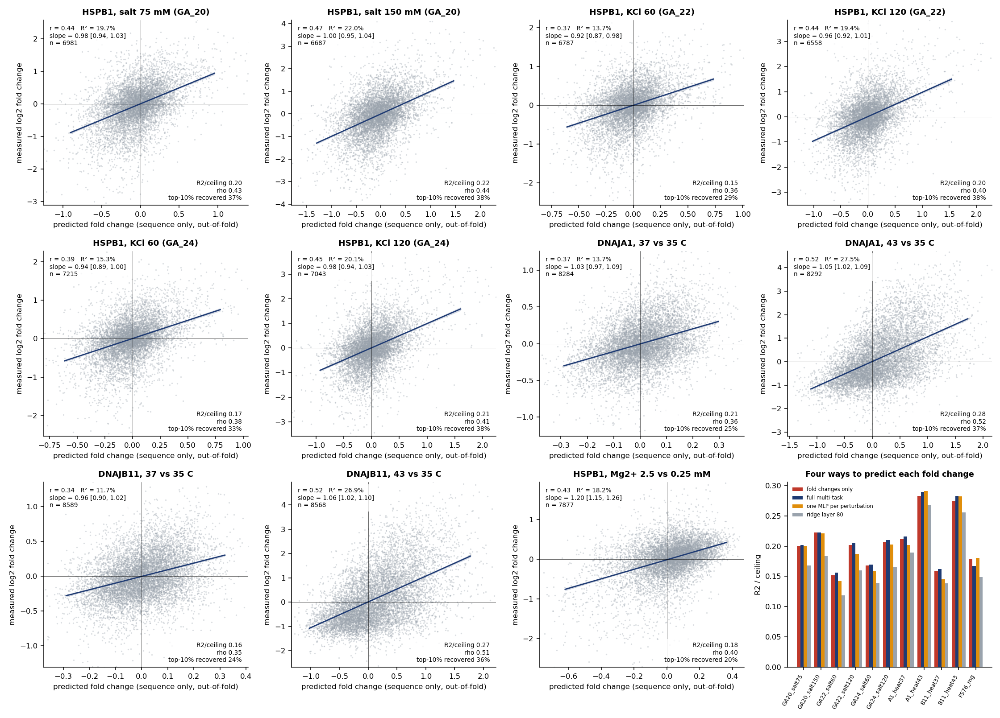
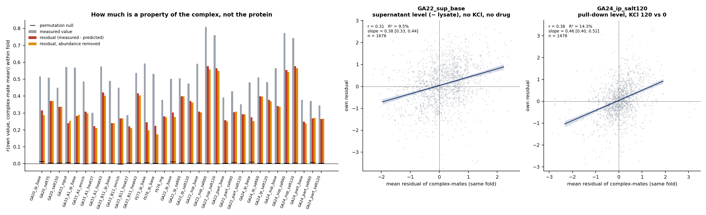
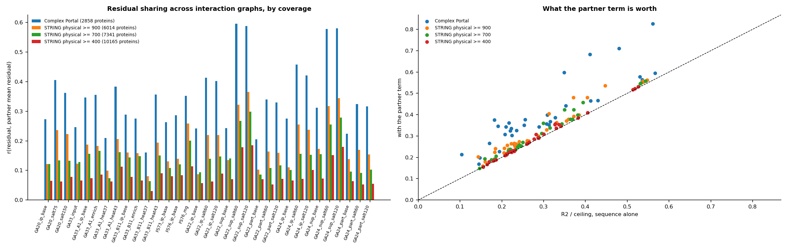
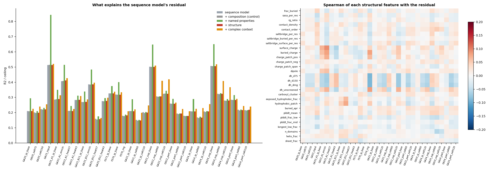

# Summary

**The task.** One multi-task MLP on ESMC-6B protein embeddings (the 6-billion-parameter ESM3-family
model) and its annotated sparse autoencoder (SAE). It predicts every non-drug quantity measured in the
HSP pull-downs:

| Kind | Targets | Runs |
|---------------|------------------|---------------------------|
| Baseline pull-down, no perturbation | pull-down level | GA_20, GA_22, GA_24, FS73, FS76 (HSPB1); GA_33 (DNAJA1, DNAJB11) |
| Abundance | lysate level, supernatant level | GA_22, GA_24, GA_33 |
| Abundance-free binding | bound:free partition; enrichment over input | GA_22, GA_24 (partition); GA_33 (enrichment) |
| Effects | salt | GA_20, GA_22, GA_24 |
| | temperature | GA_33 |
| | Mg^2+^ | FS76 |

That makes 33 targets over 11,541 proteins. Drug effects are excluded.

Every number is out-of-fold. Folds are grouped by 30% sequence identity, so no homolog of a test
protein is ever trained on. Each number is read against its own split-half ceiling.

| Question | Answer |
|-----------|-------------------------------------------------|
| How much does sequence predict? | Mean R² / ceiling 0.27-0.28 over all 33 targets. Abundance 0.51; abundance-free binding 0.33; baseline pull-down 0.26; temperature 0.24; salt 0.23; Mg 0.17 |
| Is it better than a linear read-out? | Yes, slightly: +0.028 [0.023, 0.034] over ridge on the best layer; most on salt (+0.039) |
| Does reading residue by residue help? | No. A learned attention-pooling front end over 7.4 M residue states equals the mean-pooled model: +0.000 [−0.003, +0.004] |
| Does one shared model help? | Marginally. Multi-task beats 33 single-task models on 22 of 32 targets, but by 0.003 R² on average |
| Do conditions share one representation? | Yes. A trunk trained without a run predicts that run nearly as well as one trained with it. The exceptions are the condition types no other run contains: heat (0.26 → 0.19) and Mg (0.15 → 0.10) |
| What predicts the pull-down with no perturbation? | Mostly how much protein there is. Measured abundance plus Tm beats sequence for every baseline. Sequence plus those measurements is best: R² 0.30-0.54 |
| Fold changes from sequence alone, no input information? | R2 0.12-0.27 per perturbation (rho 0.35-0.52), calibrated; top-10 % responders recovered 2.5-4x above chance; same accuracy as the full model (-0.002 [-0.007, +0.002]) |
| What does sequence add beyond abundance? | Salt and Mg responses: +0.056 and +0.045 R² / ceiling over measured abundance and Tm alone |
| Regressing out the baseline | Salt and Mg responses are almost untouched (83-99% of their variance remains). Heat is not: the baseline accounts for about half of the 43 °C response and half of what sequence predicts about it |
| Is the plateau a ceiling on predictability? | No, a ceiling on *per-protein* information. The residual is strongly shared among members of the same complex (r 0.22-0.58, null ~0.00). One complex-mate term lifts mean R² / ceiling 0.309 → 0.410, far more than any architecture change |
| Does AlphaFold structure help? | No. Surface vs buried ion pairs, charged surface patches, Debye-Huckel screening at the real ionic strengths and Mg^2+^ carboxylate clusters all add 0.000 over the embedding; the largest residual correlation of any structural feature is 0.092 |
| Does the native partner's interface help? | No. Measured on 29,816 experimental assemblies covering 6,306 proteins: how much exposed hydrophobic and aggregation-prone surface a native partner buries adds +0.002 (salt and heat: −0.000). Three pre-stated directional predictions all fail |
| What the SAE features say | Pull-down and abundance: structured enzymes up, phosphorylated disordered Ser/Thr-rich regions down. Abundance-free binding, salt and Mg: membrane-helix features. Heat: structured α/β enzyme cores |

**The bottom line.** Sequence predicts about a quarter of what these measurements reliably contain, and
an MLP over 94 architectures, attention pooling and multi-task sharing all hit the same plateau. That
plateau is not a limit on predictability, but the way past it is not more structure: AlphaFold surface
electrostatics, ion pairs and mask-pooled residue states all add nothing, because the embedding already
contains them. What the model misses is instead shared among the subunits of a complex, which no
sequence model can reach because the folds separate homologs and complex-mates are not homologs. One
complex-context term takes mean R² / ceiling from 0.31 to 0.41 for the quarter of proteins in a curated
complex, though it fades to +0.007 across the broad STRING physical network. That complex effect is not
an interface effect: on 29,816 experimental structures, how much surface a native partner buries explains
none of the residual and only +0.014 of the complex-shared part, so what a complex contributes is
something other than steric competition for the chaperone's binding surface. The
no-perturbation pull-down is mostly abundance and stability. The salt and Mg responses are where
sequence carries information that the measured lysate properties do not.

# 1. Data, targets and features

**Proteins.** The union of every run is 11,570 proteins, of which 11,541 have a sequence and all
features. Embeddings and SAE features already existed for 9,879. I computed the rest in one pass of
ESMC-6B (1,662 proteins, under 1 minute on one RTX card).

A control re-embedding of 60 stored proteins reproduced them: median r 1.0000. One protein moved
slightly with batch context (r 0.98). Embedded alone it sits between its two batched versions, so this
is bf16 numerics, not a pipeline error.

**Targets** (`cm02`). 33 per-protein quantities, each with a split-half reliability across proteins
(the ceiling):

| Kind | n | Ceiling range |
|---------------------------------------------------|---|--------|
| Abundance (GA_33 input, GA_22/24 supernatant) | 3 | 0.98-0.995 |
| Baseline pull-down (no perturbation) | 7 | 0.98-0.998 |
| Abundance-free binding (GA_22/24 partition, GA_33 enrichment) | 4 | 0.99 |
| Salt (GA_20 75/150 mM, GA_22/24 60/120 mM in pull-down, supernatant and partition) | 14 | 0.76-0.99 |
| Temperature (GA_33, 37 and 43 vs 35 °C, both baits) | 4 | 0.64-0.98 |
| Mg^2+^ (FS76) | 1 | 0.98 |

Drug arms were excluded throughout, with one exception: FS76's Mg effect is averaged over the lithium
doses, because lithium has no proteome-wide effect (reliability 0.14). GA_22 and GA_24 effects use only
their drug-free arms and carry the drift correction of the GA_22/24 report.

**Inputs.**

- ESMC-6B hidden states 0, 10, ..., 80, mean-pooled.
- The layer-60 SAE: 16,384 features, max over residues.
- Per-residue final-layer states for the attention model: 7.36 M residues, 37 GB.
- Sequence covariates: length, charge, pI, hydropathy, composition.
- Optionally, measured per-protein properties: lysate abundance here, PaxDb abundance, Meltome Tm.

# 2. The model and how it was trained

One MLP:

- an input branch per layer (a learned projection) and for the SAE;
- a shared trunk ending in a 64-dimensional latent;
- one linear head per target, reading that shared latent.

The loss is masked MSE over all observed targets, each standardised on the training fold.

**Efficient training.** Each architecture is trained as a population of 72-144 members, differing in
learning rate, weight decay, dropout and seed. All members are one batched computation: every weight
carries a member axis, and a vectorised AdamW applies per-member hyperparameters.

All inputs sit on the GPU. Each member is early-stopped on an inner validation fold, and the outer test
fold is predicted by the mean of the eight best members (chosen on validation only).

**GPU choice.** RTX PRO 6000 (96 GB) for everything:

- data plus a population is 2-50 GB;
- the attention model holds 37 GB of residue states plus 15-25 GB of work;
- nothing needed an H100 or H200.

| Job type | SM active | Occupancy | Tensor active | DRAM active | Peak memory |
|------------|------|------|---------|--------|--------------------|
| MLP populations | 0.84-0.95 | 0.49-0.58 | 0.04-0.05 | 0.76-0.87 | 3-50 GB |
| Attention MLP | 0.95 | 0.48 | 0.21 | 0.66 | 54-66 GB |
| ESMC-6B embedding | | | | | 18.5 GB at 12-17 k residues/s |

The populations are memory-bandwidth-bound: the matrices per member are small. Packing more members per
step was the lever, and it kept SM activity near the maximum.

**Scale.** About 10 GPU-hours on at most 8 RTX cards, in roughly three hours of wall clock:

- 94 MLP architectures;
- 7 attention configurations;
- 33 single-task models;
- 6 leave-one-run-out trunks;
- 6 residualisation and covariate models.

I stopped four sweep jobs early. Their SAE-input groups cost 10-20 minutes each and had already shown
that the SAE adds nothing to the dense layers.

# 3. How much sequence predicts

{width=100%}

{width=100%}

Mean R² / ceiling, all targets, with paired cluster-bootstrap intervals (1,000 resamples of sequence
clusters):

| Model | All | Abund. | Base. | Enrich. | Salt | Temp. | Mg |
|----------------------------|----|-----|----|------|----|----|----|
| Ridge, ESMC layer 80 | 0.245 | 0.504 | 0.240 | 0.302 | 0.191 | 0.213 | 0.149 |
| MLP, layers 50+80 | 0.273 | 0.506 | 0.261 | 0.333 | 0.229 | 0.238 | 0.168 |
| Attention MLP | 0.273 | 0.505 | 0.257 | 0.336 | 0.230 | 0.239 | 0.172 |
| Abundance + Tm only (32 t.) | 0.286 | 0.729 | 0.336 | 0.403 | 0.186 | 0.246 | 0.131 |
| Sequence + abundance + Tm (32 t.) | 0.316 | 0.703 | 0.348 | 0.416 | 0.243 | 0.258 | 0.176 |
| Sequence only (32 t.) | 0.263 | 0.497 | 0.257 | 0.329 | 0.228 | 0.233 | 0.167 |

The models marked "32 t." are trained on 32 targets; the MLP row is the multi-task model with 144 members; the lysate abundance target is
dropped because it is the abundance input.

| Comparison | Difference in R² / ceiling, 95% interval |
|-------------------|-----------------------------------------|
| MLP − ridge | all +0.028 [0.023, 0.034]; salt +0.039 [0.028, 0.050]; enrichment +0.031; abundance +0.002 (n.s.) |
| Attention − mean-pooled MLP | all +0.000 [−0.003, +0.004]; no kind differs |
| Sequence + measurements − measurements alone | salt +0.056 [0.042, 0.072]; Mg +0.045 [0.024, 0.065]; baseline +0.012 (n.s.); abundance −0.026 |
| Measurements − sequence | abundance +0.233; baseline +0.079; enrichment +0.074; salt −0.042; Mg −0.036 |

**A plateau.** All 94 MLP architectures lie within 0.274-0.276 of the best. That holds across:

- layer sets (50 + 80 or all nine);
- projection widths of 32-256;
- latents of 16-256;
- trunks of 256-2,048;
- 150 or 300 epochs.

The SAE as an input is worse than the dense layers: 0.18 alone, nothing added on top. Attention pooling
over residues, at 4, 8 or 16 heads (seven configurations, 0.268-0.273 of ceiling), equals mean pooling. The ensemble's members are nearly
interchangeable (best member vs top-8 mean: r 0.9996).

The limit is what ESMC-6B's representation carries about these measurements, not the read-out.

**The one weakness.** Adding sequence to the measured covariates lowers abundance (0.729 → 0.703) and a
few individual baselines. The combined model's regularisation does not fully adapt when one input block is far
more informative than the other. A residual design (sequence predicting what the covariates leave) would
avoid this.

# 3b. Fold changes alone: each perturbation from sequence, with no input information

This model knows nothing about the input / lysate distribution. One MLP is trained only on the 11 pull-down fold
changes, with no abundance, supernatant, partition or baseline targets and no measured covariates: ESMC-6B layers
50 + 80 and sequence covariates in, 11 fold changes out (`cm11`, run `s5`).

{width=100%}

| Perturbation | Ceiling | R2 | R2/ceil. | rho | Top 10 % | Bottom 10 % | Sign |
|---------------------|------|----|-------|---|-------|---------|---|
| HSPB1, salt 75 mM (GA_20) | 0.98 | 0.197 | 0.20 | 0.43 | 37 % | 30 % | 79 % |
| HSPB1, salt 150 mM (GA_20) | 0.99 | 0.220 | 0.22 | 0.44 | 38 % | 29 % | 80 % |
| HSPB1, KCl 60 (GA_22) | 0.90 | 0.136 | 0.15 | 0.36 | 29 % | 27 % | 76 % |
| HSPB1, KCl 120 (GA_22) | 0.96 | 0.193 | 0.20 | 0.40 | 38 % | 27 % | 78 % |
| HSPB1, KCl 60 (GA_24) | 0.91 | 0.152 | 0.17 | 0.38 | 33 % | 27 % | 76 % |
| HSPB1, KCl 120 (GA_24) | 0.97 | 0.201 | 0.21 | 0.41 | 38 % | 25 % | 79 % |
| DNAJA1, 37 vs 35 C | 0.64 | 0.136 | 0.21 | 0.36 | 25 % | 28 % | 79 % |
| DNAJA1, 43 vs 35 C | 0.97 | 0.274 | 0.28 | 0.52 | 37 % | 33 % | 89 % |
| DNAJB11, 37 vs 35 C | 0.74 | 0.117 | 0.16 | 0.35 | 24 % | 25 % | 77 % |
| DNAJB11, 43 vs 35 C | 0.98 | 0.268 | 0.27 | 0.51 | 36 % | 27 % | 89 % |
| HSPB1, Mg2+ 2.5 vs 0.25 mM | 0.98 | 0.176 | 0.18 | 0.40 | 20 % | 37 % | 77 % |

"Top / Bottom 10 %": of the proteins measured in the top (or bottom) 10 %, the share the prediction also places in its
top (bottom) 10 %; chance is 10 %. "Sign": among the 10 % of proteins with the largest measured change,
the share whose predicted change is on the same side of the median.

* **Sequence alone predicts every fold change, modestly**: R2 0.12-0.27 (0.15-0.28 of ceiling), rank correlation
  0.35-0.52. The predictions are calibrated (out-of-fold slopes 0.92-1.06; Mg 1.20), so the size of a predicted
  change means what it says.
* **As a screen it is 2.5-4 times better than chance**: a quarter to over a third of the strongest responders in
  each direction land in the predicted top or bottom 10 %, and the direction is right for 76-89 % of the strongest.
  Heat at 43 C is the most predictable perturbation; KCl 60 mM and heat 37 C, the smallest effects, the least.
  Mg is asymmetric: proteins that fall with Mg are found far better (37 %) than those that rise (20 %).
* **Leaving out the input information costs nothing**: the fold-change-only model equals the full multi-task model
  (difference in mean R2 / ceiling -0.002 [-0.007, +0.002]), matches one MLP per perturbation (+0.004 [-0.000,
  +0.008]) and beats ridge (+0.030 [0.022, 0.037]). The abundance and baseline targets did not help the network
  learn the fold changes, consistent with section 5.3: salt and Mg responses are largely independent of the baseline.

# 3c. What the model misses is largely a property of the complex, not the protein

Section 3 reports a plateau: 94 architectures, attention pooling over every residue, single- against multi-task, all
land within 0.274-0.276 of ceiling. A plateau can mean the representation is exhausted, or that the remaining
variance is not a function of the protein's sequence at all. The second possibility is testable (`cm12`).

A pull-down measures a protein that may be held in a multi-subunit assembly, so its level, and its response to a
perturbation, can be a property of the assembly. Sequence cannot reach that. The design makes the test clean: the
outer folds are grouped by MMseqs2 30 % identity and the subunits of a complex are unrelated in sequence, so
complex-mates scatter across folds and no complex-level effect is learnable from sequence by construction. Any such
effect therefore lands entirely in the residual.

For every target, each protein's residual (measured minus out-of-fold prediction) is correlated with the mean
residual of its other Complex Portal complex-mates, taken **within the same outer fold** so that both sides are
held out of the same model. The null is not zero -- residuals share abundance and other structure -- so it is
obtained by shuffling residuals within fold, 500 draws, which preserves every complex's size and each protein's
fold while destroying the pairing.

{width=100%}

| Target kind | n | Residual r | Null | R2/ceil. | + complex | Gain |
|-------------|---|------------|------|----------|-----------|------|
| baseline | 7 | 0.27 | 0.007 | 0.384 | 0.440 | +0.055 |
| abundance | 3 | 0.30 | 0.004 | 0.557 | 0.584 | +0.027 |
| enrichment | 4 | 0.27 | -0.001 | 0.250 | 0.299 | +0.049 |
| salt | 14 | 0.40 | 0.003 | 0.281 | 0.445 | +0.164 |
| temperature | 4 | 0.32 | 0.004 | 0.193 | 0.266 | +0.073 |
| Mg | 1 | 0.28 | -0.001 | 0.113 | 0.213 | +0.100 |
| **all 33** | **33** | **0.34** | **0.004** | **0.309** | **0.410** | **+0.101** |

Scored on the 2,858 proteins that are in a Complex Portal complex with at least two measured members; "+ complex"
adds one cross-fitted term, the complex-mate mean residual, with its coefficient fitted on the other outer folds.

* **The residual is strongly complex-structured for every target**: r 0.22-0.58 against a null of ~0.00,
  z = 6.3-16.9. The effect is largest where the sequence model is weakest.
* **It is worth more than everything architecture gave**: mean R2 / ceiling rises 0.309 to 0.410. On the salt
  responses it roughly doubles R2 (GA_22 KCl 60: 0.19 to 0.37; GA_24 KCl 60: 0.17 to 0.35), and on heat at 43 C it
  rises from 0.22-0.24 to 0.31-0.35. For comparison, the entire MLP-over-ridge gain is +0.028.
* **It is not abundance.** Projecting out `abundance_here`, PaxDb abundance and length barely moves it
  (mean r 0.336 to 0.326).
* **It is not shared peptides or paralogues.** The deployable variant, in which a protein's partner mean is taken
  only from **training-fold** proteins -- measurements already in hand, never in the test protein's own 30 %
  identity cluster -- performs identically (0.410 against 0.403). That version is also the honest one: it uses no
  held-out measurement.

Two limits. This is measured on the 25 % of proteins Complex Portal annotates with a measured partner; Complex
Portal is incomplete, so the coverage is a floor, not a statement about the other 75 %. And the term consumes
measured partner data, so it improves annotation of a *measured* proteome, not the sequence-only prediction of an
unmeasured one -- for a complex with no measured member it offers nothing.

**How far does it reach?** Complex Portal annotates only a quarter of the measured proteins, so the test was
repeated on the STRING v12 *physical* subnetwork at three confidence cutoffs, which buys coverage at the cost of
specificity (`cm16`, same training-fold-only design).

| Graph | Proteins | Median degree | Residual r | R2/ceil. | + partner | Gain |
|-----------------|------|----------|--------|------|-------|-----|
| Complex Portal | 2,858 | 5 | 0.346 | 0.300 | 0.401 | +0.101 |
| STRING physical >= 900 | 6,014 | 4 | 0.187 | 0.291 | 0.323 | +0.032 |
| STRING physical >= 700 | 7,341 | 6 | 0.145 | 0.286 | 0.306 | +0.019 |
| STRING physical >= 400 | 10,165 | 12 | 0.085 | 0.280 | 0.287 | +0.007 |

{width=100%}

The effect is **specific to curated stable complexes and decays fast as the graph widens**. STRING reaches 10,165
of 11,570 proteins, but at that coverage a protein's partner mean is an average over a dozen loose associations
and is worth +0.007. This tempers the claim above: complex context is a large lever for the quarter of the
proteome that sits in a defined assembly, and a small one for the rest. It is not a general route to the other
three quarters, and the honest summary of the campaign-wide number is that 0.41 applies to 2,858 proteins.

The conclusion for the campaign is that the ~0.27 plateau is the ceiling on *per-protein* sequence information,
not on predictability. Interaction context is a larger lever than any change to the network.

# 3d. Structure, tested directly: it adds nothing

A simple probe motivates this section. Of the sequence covariates, net charge per residue is the single strongest
predictor of the salt response, reproducibly across three independent experiments (Spearman rho 0.20-0.23 for
GA_20, GA_22 and GA_24). But the *capacity* to form ion pairs is not: 2 x min(D+E, K+R) gives rho -0.04 to -0.10,
and the total charged fraction -0.02 to -0.09. And every one of these is orthogonal to the sequence model's
residual (|rho| <= 0.07), so the network has already absorbed the compositional charge signal completely. For
salt its prediction is close to a pure charge axis: rho(prediction, measured) 0.36-0.44 against rho(prediction,
net charge) 0.38-0.41.

Whatever is left, if it is a protein property at all, therefore has to be spatial -- *where* the charge sits,
whether an ion pair is buried or solvent-facing, how large a contiguous charged patch is. None of that survives
averaging over residues. So the AlphaFold human proteome was folded in (`cm13`): 20,256 models parsed, none
failed, and the model sequence is byte-identical to the embedded sequence for 20,001 of them, so per-residue
quantities cannot be silently misaligned. Features per protein: relative SASA and burial; ion pairs split into
buried and surface; surface charge, buried charge, the most charged 10 A surface neighbourhood, dipole; the change
in intramolecular Debye-Huckel energy between the two ionic strengths **actually used in each experiment**
(kappa = 0.329 sqrt(I) /A, with MgCl2 contributing I = 3c); carboxylate clusters as the geometric signature of a
Mg^2+^ site; exposed and buried hydrophobic patches; pLDDT disorder and domain counts; crude secondary structure.

The test is not whether these predict the response -- they do, because they correlate with composition -- but
whether they predict the **residual** of the out-of-fold sequence prediction (`cm14`, cross-fitted ridge, alpha
chosen inside the training folds).

{width=100%}

| Added to the sequence model | Mean R2 / ceiling, 33 targets |
|------------------------------------|------------------------|
| nothing (the sequence model) | 0.273 |
| composition, 25 covariates (negative control) | 0.271 |
| **AlphaFold structure, 28 features** | **0.272** |
| named properties (abundance, Tm, keywords) | 0.320 |
| complex context | 0.304 |
| structure + named | 0.322 |
| everything | 0.348 |

* **Structure adds nothing.** The bootstrap interval straddles zero on almost every target, and structure over
  the named properties is likewise null. The composition control behaves identically, which is the evidence that
  the test can detect "already absorbed" rather than being insensitive.
* **Resolving ion pairs in 3D does not rescue the hypothesis.** Averaged over the 14 salt targets, every charge
  and ion-pair feature correlates with the measured response and with nothing in the residual:

| Feature | rho with measured | rho with residual |
|-------------------------------|-------|-------|
| surface charge | +0.167 | +0.027 |
| buried charge | +0.152 | +0.016 |
| largest positive surface patch | +0.075 | +0.010 |
| salt bridges per residue | -0.041 | +0.004 |
| salt bridges, buried only | -0.006 | +0.003 |
| salt bridges, surface only | -0.048 | +0.006 |
| Debye-Huckel dE at 150 mM | -0.080 | -0.035 |
| carboxylate clusters (Mg^2+^) | -0.042 | +0.012 |

The largest residual correlation of **any** structural feature with **any** target is 0.092.

**Pooling the embedding over structural masks does not help either.** Instead of averaging the ESMC states over
  the whole protein, they were pooled separately over surface, buried, ordered, disordered, charged-surface,
  hydrophobic-surface and buried-hydrophobic residues (`cm15`), giving the network the masks rather than making it
  learn them. On the 11 fold changes: sequence alone 0.2053, + structural features 0.2068, + mask pooling 0.2078,
  + both 0.2066. The internal check that the "all" mask reproduces the stored mean-pooled layer 80 gives r = 1.0000.

**The caveat that matters.** An AlphaFold model is itself predicted from sequence, and protein language models are
known to encode structure implicitly, so this is close to asking whether one sequence-derived view adds to
another. The result says that nothing these summary statistics extract from a predicted **single-chain, unbound,
unmodified** structure is missing from the embedding. It does not say 3D geometry is irrelevant to salt
sensitivity. The quantity the salt-bridge hypothesis is really about is the electrostatics of the chaperone-client
*interface*, which needs a structure of the complex, not of the client alone.

# 3e. The native partner, tested on experimental structures: it adds nothing either

Section 3d left one escape route open: an AlphaFold model is predicted from the same sequence the network
reads, so a null there is half-expected. A **complex** is not. It is a function of two sequences and their
pairing, and the pairing is outside the model's input entirely -- which is exactly why the complex-mate term in
3c worked. So the next question is whether the missing variance is an *interface* property.

The hypothesis is competition. HSPB1 binds exposed hydrophobic and aggregation-prone surface on non-native
clients. A protein that spends its life with that surface buried against a native partner should be a poor
client, and a perturbation that loosens the native interface should make it a better one. That predicts a
specific thing about the residual, and it is testable with structures that already exist -- no prediction, no
GPU, 17 minutes of CPU.

**What was measured** (`cm17`, `cm18`). Every PDB biological assembly containing at least one measured protein,
capped at 15 structures per protein, is 29,816 assemblies. For each measured chain the solvent-accessible
surface was computed twice -- alone, and in the presence of its partners -- and the difference resolved by
residue class: total buried area, the fraction of *exposed hydrophobic* surface a partner occludes, the same for
aggregation-prone regions, the composition and ion-pair density of the interface itself, and occlusion by
nucleic acid. That is 15 features, each aggregated over structures as median, max and min, for **6,306 of the
11,570 proteins** (1,816 of which have no interface in any structure -- the informative zero, deliberately kept).

Entries holding at least *one* measured protein, not two: requiring a measured partner would condition on
having a partner, which is close to the variable under test. Whether a partner chain was itself measured is
irrelevant to how much surface it buries.

**The guards.** Chains were aligned to their UniProt sequence (median identity 1.000, p05 0.987; 546 of 110,832
chains fell below 0.80 and were dropped). RCSB names symmetry copies `A-2` where SIFTS calls them `A`; matching
on the raw name would have silently discarded exactly the symmetry-generated partners that matter most, such as
a homodimer absent from the asymmetric unit. The 10,462 chains with no partner chain in their assembly come out
with a mean interface fraction of 0.00008, as they must.

**The positive control.** Before asking whether the features explain anything, they have to agree with things
already known. Complex Portal members bury 0.176 of their surface against 0.090 for non-members, and burial
correlates with Meltome T~m~ at rho +0.170 (n = 5,407). The measurement is real.

**The result is a null, and a flat one** (`cm19`, mean R² / ceiling over 33 targets):

| Block added to the sequence model | R² / ceiling |
|---------------------------------------------------|---------|
| sequence alone | 0.278 |
| + study-depth control (structure count, chain size, partner count) | 0.278 |
| + composition control | 0.278 |
| **+ native-partner interface** | **0.280** |
| + named properties (abundance, T~m~, keywords) | 0.326 |
| + complex-mate term (3c) | 0.319 |
| + everything | 0.353 |

By kind, the interface block adds +0.002 to baselines, +0.001 to enrichment, +0.007 to abundance, and
**−0.000 to both salt and temperature** -- the two response types the hypothesis was built for. Every
per-target bootstrap interval for the interface gain over the depth control includes zero.

**The three directional predictions, fixed before looking, all fail.**

| Prediction | Feature | Targets | rho with residual |
|---------------------|------------------|-----|---------------|
| D1 salt releases an ionically held interface | interface ion pairs per 1000 Ų | 14 salt | −0.009 to +0.025, every CI includes 0 |
| D2 heat unmasks occluded aggregation-prone surface | fraction of APR surface occluded | 4 temperature | −0.022 to +0.008 |
| D3 leftover hydrophobic surface is what HSPB1 binds | exposed hydrophobic area in the bound state | 7 baselines | −0.011 to +0.014 |

D3 is worth a second look because it fails in an interesting way: on the *measured* scale it correlates
**negatively** with the HSPB1 baselines (−0.050 to −0.081 for FS73, FS76, GA_20, GA_22, GA_24), the opposite of
the prediction. Proteins with more hydrophobic surface left exposed in their native complexes are pulled down
slightly *less*. That sign is consistent with those proteins being small, abundant and stable rather than with
any chaperone-competition story, and it vanishes entirely in the residual (+0.009), so the sequence model
already accounts for it.

The largest residual correlation of **any** of the 46 interface features with **any** of the 33 targets is
0.087 -- essentially the same ceiling as the 0.092 found for AlphaFold monomer features in 3d.

**One near-miss, and why it is not a result.** Interface features predict the complex-mate mean residual of 3c
at r = +0.080. But a control block built only from study depth and chain size reaches +0.066, so the interface
contributes +0.014. In an earlier version of this analysis that gap looked like +0.04; the difference was an
artefact of aggregating over however many structures a protein happens to have, since a maximum over 311
structures is mechanically larger than one over 3. Subsampling to a fixed cap before aggregating removed most
of the apparent effect. The honest reading is that the complex-level signal of 3c is **not** explained by how
much surface the partner buries.

**What this does and does not close.** It closes the version of the competition hypothesis that can be answered
with static, unbound-versus-bound surface burial in native complexes, measured on more than half the proteome.
It does not touch the chaperone side: none of these structures contains HSPB1, and the quantity the hypothesis
is ultimately about is the interface between the chaperone and a *non-native* client -- a state that is
essentially absent from the PDB, because it is transient, low-affinity and disordered. Testing that needs a
model of the bound complex, which is the next tier and a genuinely different experiment.

# 4. What predicts the pull-down with no perturbation

A pull-down level mixes how much protein is in the tube (abundance) with how strongly it binds. Both
parts were tested with named, readable properties, alone and with the sequence model (`cm07`).

{width=100%}

| Predictor set | HSPB1 pull-down | DNAJA1/B11 pull-down | Binding over abundance |
|-----------------------|----------|-------------|--------------|
| Abundance (here + PaxDb) | 0.23-0.32 | 0.15-0.16 | 0.19-0.40 |
| + Tm, sequence physics, location | 0.28-0.36 | 0.26 | 0.25-0.49 |
| All named properties | 0.29-0.37 | 0.27-0.28 | 0.26-0.50 |
| Named properties without abundance | 0.09-0.17 | 0.15-0.16 | 0.16-0.25 |
| Sequence MLP alone | 0.21-0.32 | 0.27-0.28 | 0.26-0.40 |
| **Sequence MLP + named properties** | **0.31-0.42** | **0.34-0.35** | **0.30-0.54** |

Values are out-of-fold R². The ceilings here are 0.98-0.998, so R² / ceiling differs by under 0.01.

What the properties show:

- **Abundance dominates the raw pull-down.** It correlates with every HSPB1 baseline (rho 0.46-0.57).
- **It reverses for enrichment.** Abundant proteins are less enriched over input (rho −0.57 to −0.60
  in GA_33). Capture rises less than proportionally with amount, as found before (slope about 0.35).
- **Abundance-free binding** rises with transmembrane segments and with positive charge (DNAJA1:
  rho +0.30 with pI), and falls with stability (Tm, rho −0.21 to −0.27).
- **Ribonucleoprotein and complex membership** raise the raw HSPB1 pull-down slightly.

Sequence predicts the abundance-free binding about as well as all the named properties together, and
the two combined are best. So sequence carries most of what the named properties do, and somewhat more.

# 5. One representation across conditions

## 5.1 Leave-one-run-out transfer

Six trunks were each trained without one run's targets. That run's targets were then read out from the
frozen latent by ridge, within each fold, since fold models' latents are not aligned with each other.

{width=100%}

| Run left out | Its targets, read from a trunk that never saw it (with the run) |
|-----------------------|-------------------------------------|
| GA_20 (HSPB1, salt) | baseline 0.20 (0.19); salt 75 / 150: 0.16 / 0.18 (0.16 / 0.18) |
| GA_22, GA_24 (HSPB1, salt; with supernatant and partition) | within 0.00-0.03 of trained-with for all 18 targets |
| FS73 (HSPB1) | baseline 0.28 (0.30) |
| FS76 (HSPB1, Mg) | baseline 0.28 (0.29); **Mg 0.10 (0.15)** |
| GA_33 (DNAJA1/B11, heat) | abundance 0.47 (0.49); enrichment 0.32-0.34 (0.36-0.38); **heat 43 °C 0.18-0.19 (0.25-0.26)** |

One shared representation covers every HSPB1 baseline and salt condition: no run teaches it something
the others do not. What it loses when a run is left out is a condition type found nowhere else. Heat
exists only in GA_33 and Mg only in FS76. The two DNAJ baits also lose a little on their baselines.

The measured cross-run prediction (orange) shows how much the conditions share as data:

- salt responses are 70-93% predictable from the other salt experiments' measurements;
- heat is only 9-34% predictable from anything else measured.

Heat is the condition least like the others.

## 5.2 Which conditions the model represents along the same axes

{width=85%}

The latent organises the conditions into a few axes:

- **Salt, pull-down and partition:** one axis shared by all three salt experiments (GA_20, GA_22,
  GA_24).
- **Salt, supernatant:** a separate axis. Salt changes the free pool along different directions from
  binding, as the GA_22/24 report found from the data.
- **Abundance and baselines:** an abundance axis carrying the supernatant and input levels, with the
  baselines close to it.
- **Enrichment and partition:** pointing opposite to abundance.
- **Heat:** an axis of its own.
- **Mg:** aligned with nothing.

## 5.3 Regressing the baseline out

Two versions, which agree.

**(a) In the model.** Within each fold, the subspace of the latent that predicts abundance, baselines
and enrichment (rank 14) was projected out, and each effect read again. Effects barely change:

- GA_20 salt: 0.16 → 0.15;
- heat 43 °C: 0.25 → 0.24;
- Mg: 0.15 → 0.13.

The effect signal sits in directions separate from the baseline signal.

{width=100%}

**(b) In the data.** Each effect was residualised on its own run's measured baseline and abundance,
fitted on training proteins only, and a fresh MLP was trained on the residuals.

Effect and baseline in one run share their control samples, and therefore their measurement noise. So
I repeated it with baselines from an independent experiment: GA_24's for GA_22, FS73's for GA_20 and
FS76, the other bait's for GA_33.

| Effect | Variance left after removing baseline (own run / independent run) | Sequence R², raw → residual (own / independent) |
|---------------|--------------------------|-------------------|
| Heat 43 °C, DNAJA1 | 0.52 / 0.68 | 0.27 → 0.13 / 0.20 |
| Heat 43 °C, DNAJB11 | 0.52 / 0.52 | 0.26 → 0.13 / 0.10 |
| Heat 37 °C | 0.86-0.88 / 0.85-0.97 | 0.11-0.13 → 0.07-0.11 |
| Salt, pull-down (GA_20, GA_22, GA_24) | 0.83-0.94 / 0.90-0.94 | essentially unchanged |
| Salt, supernatant | 0.83-0.99 / 0.84-0.99 | unchanged or higher (0.25 → 0.28-0.31) |
| Mg | 0.92 / 0.97 | 0.17 → 0.16 / 0.15 |

The heat response at 43 °C is about half a starting-level effect. Proteins' 43 °C change depends on
their 35 °C level, even when that level comes from another experiment. About half of what sequence
predicts about heat goes through that level.

Salt and Mg responses are condition-specific. Almost none of their variance is explained by the
baseline, and what sequence predicts about them is untouched by removing it.

# 6. What the SAE features say

Gradient attribution through an SAE-input model was unstable from fold to fold (r 0.19-0.29). The
16,384 features are highly redundant, and different fold models credit different members of correlated
groups. So the features are ranked by a stable statistic instead: Spearman rho with the family-averaged
target. Its agreement between two halves of the proteins split by sequence cluster:

| Family | Halves r | Top-50 overlap |
|---|---|---|
| Abundance | 0.93 | 0.82 |
| Pull-down baseline | 0.84 | 0.78 |
| Bound:free and enrichment | 0.90 | 0.56 |
| Salt | 0.73 | 0.72 |
| Mg | 0.79 | 0.68 |
| Temperature | 0.87 | 0.24 |

Labels are Biohub's LLM-generated annotations, which are hypotheses. Each is checked against the
UniProt keywords of the proteins on which the feature is active.

{width=88%}

| Family | Higher with (label; keyword check) | Lower with |
|------|----------------------------------|---------------------|
| Pull-down baseline, abundance | low-complexity IDRs typical of eukaryotic enzymes; NTPase catalytic residues (nucleotide-binding); basic N-terminal tails and ribosomal RNA-binding motifs (ribosomal proteins) | Ser/Thr-rich, S/T-Pro-rich and SLiM disordered regions (59-78% phosphoproteins); secreted disordered loops |
| Bound:free / enrichment | transmembrane helices, juxtamembrane loops (62-74% membrane proteins); long low-complexity IDRs | enzyme ligand-pocket β-strands and active-site loops (hydrolases); basic N-terminal mitochondrial segments |
| Salt | hydrophobic and juxtamembrane transmembrane helices (72-82% membrane) | phosphoregulated trafficking / endocytic IDR scaffolds |
| Temperature (43 °C) | α/β enzyme cores, TIM barrels, active-site helix caps (nucleotide-binding, hydrolases) | membrane, secreted, signal-peptide and disordered features |
| Mg | transmembrane-helix features (61-75% membrane) | acidic tails, charged coiled coils, nuclear interfaces |

**Two cautions.**

- The membrane axis appears in salt, Mg and enrichment alike. It may describe how membrane proteins
  behave in a detergent-free lysate (aggregation, insolubility) as much as chaperone binding.
- The heat features (structured α/β enzyme cores) fit thermal unfolding, but the temperature ranking's
  top features are the least stable of any family (top-50 overlap 0.24). Read them as a class, not as
  individual features.

# 7. A proteome-wide prediction table

The five fold models were applied to the 8,836 reviewed human proteins that no run measured; each fold
model was trained on 80% of the measured proteins. This adds predictions for every target to the
out-of-fold predictions for the 10,777 measured proteins: 19,613 proteins in
`data/campaign/proteome_predictions.tsv`.

The expected accuracy is each target's out-of-fold R² (0.10-0.49). The table is a prior for picking
candidates, not a substitute for measurement.

{width=100%}

# 8. Critical evaluation

1. **One protein-level representation.** ESMC-6B mean-pooled states carry about a quarter of the
   reliable variance, and nothing tried here moved that. The rest is either not in the sequence (lysate
   state, complex membership, post-translational state, local concentration) or not in this
   representation. The measured covariates show the first is substantial for baselines.
2. **Abundance as input or target.** For baselines, measured abundance is the strongest predictor, and
   sequence partly predicts it. The fair question is what sequence adds beyond abundance. That is small
   for baselines (+0.012, interval includes 0) and real for salt and Mg.
3. **Shared measurement noise.** In-run residualisation shares control samples between effect and
   baseline. The independent-baseline version removes that and gives the same answer.
4. **Not every run measures abundance.** HSPB1's FS73 / FS76 and GA_20 have no supernatant or input,
   so abundance comes from GA_33's lysate and PaxDb. Different lysate preparations add noise.
5. **The SAE is not an accurate input.** It is the most interpretable one, but on its own it predicts
   less (0.18) than the dense layers. Its feature associations describe the measurements, not the
   model's predictions.
6. **Bugs found and fixed during the campaign:**
   - a shared row-index file overwritten by later specs, which zeroed the first latent read-out;
   - a drift-covariate aliasing in the linear model on sparse proteins (from the GA_22/24 work);
   - variable shadowing in the per-residue writer, caught by its own completeness assertion.

   Each was caught by a check before any number was reported.

# 9. Files

- **Code:**
  - `cm00_union.py`, `cm01_embed.py`, `cm01b_residues.py` (embeddings, SAE, per-residue states);
  - `cm02_targets.py`, `cm02b_features.py` (targets, features, folds);
  - `cm03_mlp.py` (population MLP, covariates, residualisation), `cm03b_ridge.py`;
  - `cm04_latent.py` (transfer, regress-out, geometry, measured cross-run);
  - `cm05_attrib.py`, `cm05b_assoc.py`, `cm05c_annot.py` (SAE);
  - `cm06_attn.py` (attention pooling), `cm07_baseline.py` (named properties);
  - `cm08_figures.py`, `cm09_stats.py` (bootstrap), `cm10_proteome.py`;
  - `cm12_complex.py`, `cm16_network.py` (complex and network context, 3c);
  - `cm13_structure.py`, `cm15_maskpool.py`, `cm14_struct_test.py` (AlphaFold structure, 3d);
  - `cm17_pdb_index.py`, `cm18_interface.py`, `cm19_iface_test.py` (experimental interfaces, 3e);
  - `cm_launch.py` and `cm_summary.py` (sweeps);
  - `slurm/cm0*.sbatch`, `slurm/cm1[3689].sbatch`.
- **Results:** `data/campaign/`:
  - `runs/` (every group: config, R², out-of-fold predictions, latents, saved models);
  - `ridge.json`, `cm07_baseline.json`, `cm09_stats.json`;
  - `attrib/` (associations, annotated features);
  - `cm12_complex.json`, `cm16_network.json`, `cm14_struct.json`, `cm19_iface.json`;
  - `struct.tsv`, `interface.tsv`, `iface_entry.tsv`, `pdb_manifest.tsv`;
  - `proteome_predictions.tsv`.
- **External data:** `data/external/`: `complexes/` (Complex Portal), `string/`, `sifts/`,
  `afdb_human/` (AlphaFold human proteome tar), `pdb_assemblies/cif/` (29,816 RCSB biological assemblies,
  11 GB, fetched by `code/fetch_pdb_assemblies.sh`).
- **Figures:** `reports/figures/campaign/`.
