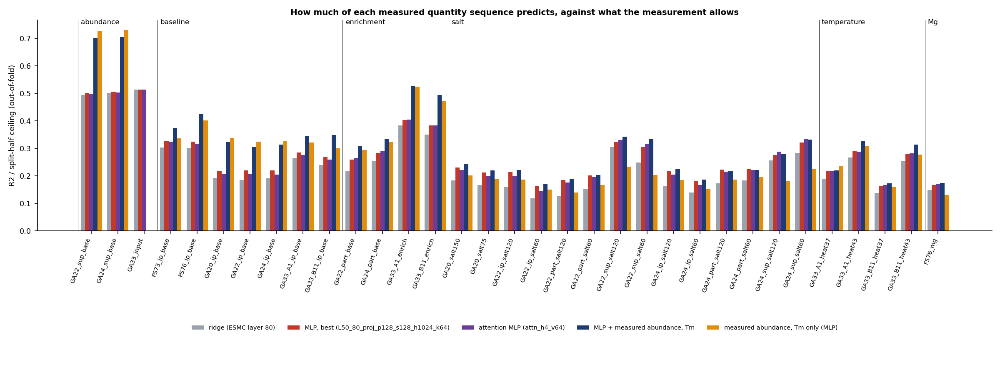
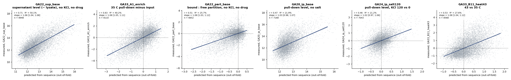
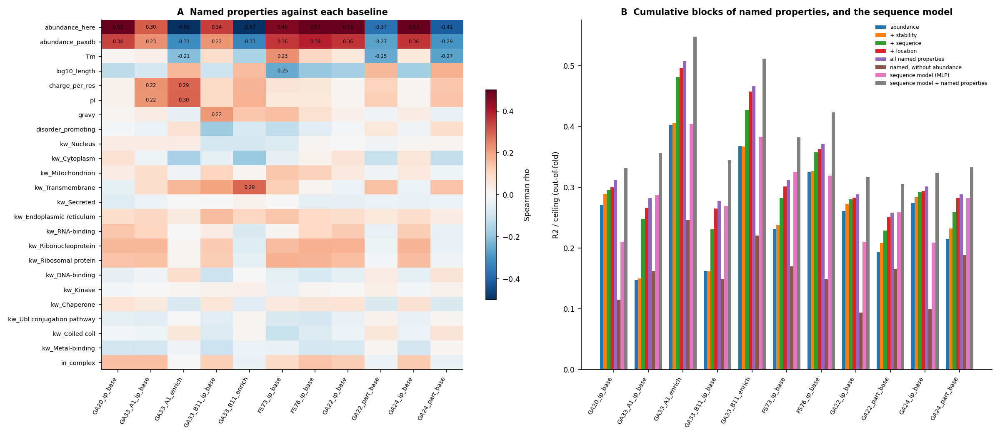
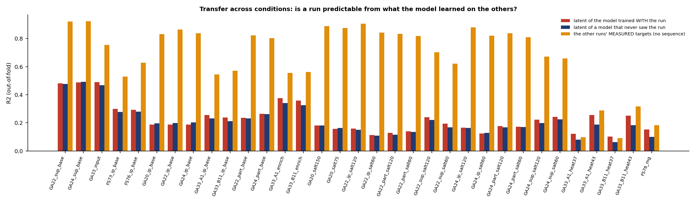
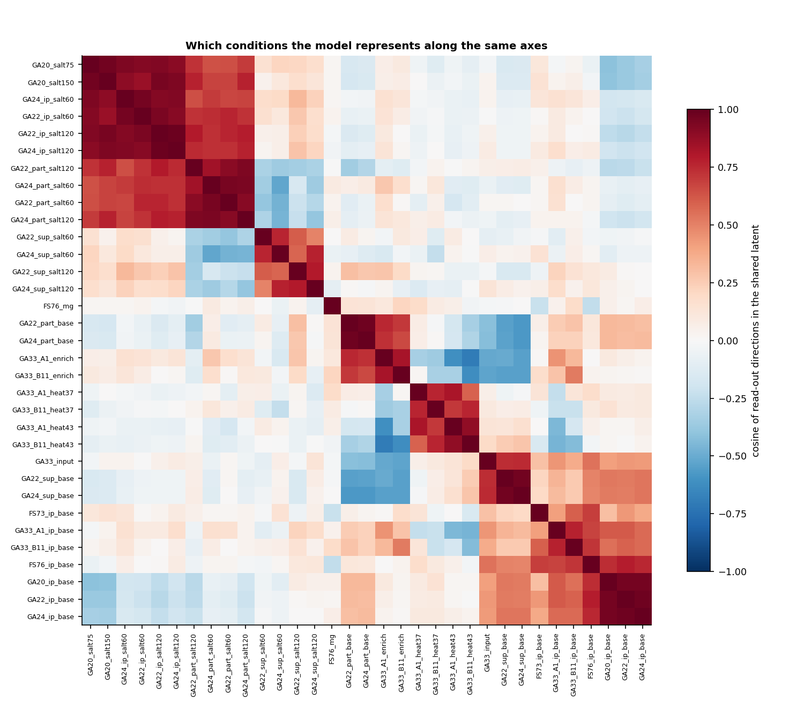
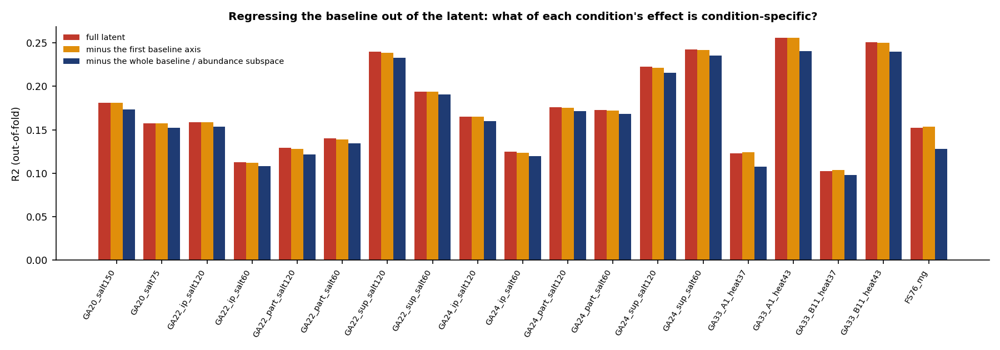
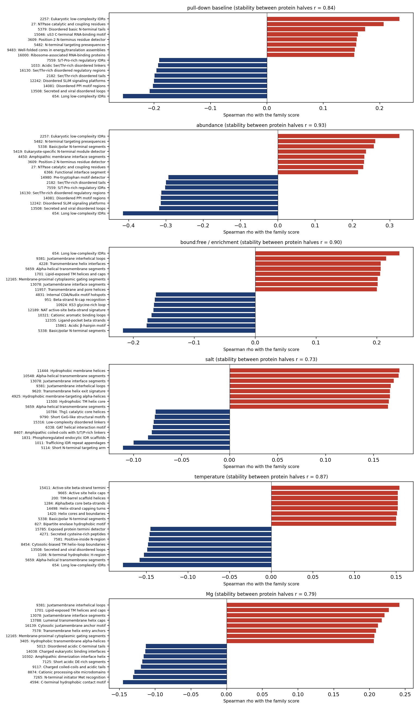
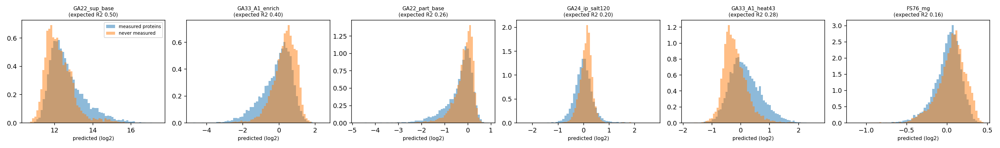

# Summary

**The task.** One multi-task MLP on ESMC-6B protein embeddings (the 6-billion-parameter ESM3-family
model) and its annotated sparse autoencoder (SAE). It predicts every non-drug quantity measured in the
HSP pull-downs:

| Kind | Targets | Runs |
|---------------|------------------|---------------------------|
| Baseline pull-down, no perturbation | pull-down level | GA_20, GA_22, GA_24, FS73, FS76 (HSPB1); GA_33 (DNAJA1, DNAJB11) |
| Abundance | lysate level, supernatant level | GA_22, GA_24, GA_33 |
| Abundance-free binding | bound:free partition; enrichment over input | GA_22, GA_24 (partition); GA_33 (enrichment) |
| Effects | salt | GA_20, GA_22, GA_24 |
| | temperature | GA_33 |
| | Mg^2+^ | FS76 |

That makes 33 targets over 11,541 proteins. Drug effects are excluded.

Every number is out-of-fold. Folds are grouped by 30% sequence identity, so no homolog of a test
protein is ever trained on. Each number is read against its own split-half ceiling.

| Question | Answer |
|------------|------------------------------------------------|
| How much does sequence predict? | Mean R² / ceiling 0.27-0.28 over all 33 targets. Abundance 0.51; abundance-free binding 0.33; baseline pull-down 0.26; temperature 0.24; salt 0.23; Mg 0.17 |
| Is it better than a linear read-out? | Yes, slightly: +0.028 [0.023, 0.034] over ridge on the best layer; most on salt (+0.039) |
| Does reading residue by residue help? | No. A learned attention-pooling front end over 7.4 M residue states equals the mean-pooled model: +0.000 [−0.003, +0.004] |
| Does one shared model help? | Marginally. Multi-task beats 33 single-task models on 22 of 32 targets, but by 0.003 R² on average |
| Do conditions share one representation? | Yes. A trunk trained without a run predicts that run nearly as well as one trained with it. The exceptions are the condition types no other run contains: heat (0.26 → 0.19) and Mg (0.15 → 0.10) |
| What predicts the pull-down with no perturbation? | Mostly how much protein there is. Measured abundance plus Tm beats sequence for every baseline. Sequence plus those measurements is best: R² 0.30-0.54 |
| What does sequence add beyond abundance? | Salt and Mg responses: +0.056 and +0.045 R² / ceiling over measured abundance and Tm alone |
| Regressing out the baseline | Salt and Mg responses are almost untouched (83-99% of their variance remains). Heat is not: the baseline accounts for about half of the 43 °C response and half of what sequence predicts about it |
| What the SAE features say | Pull-down and abundance: structured enzymes up, phosphorylated disordered Ser/Thr-rich regions down. Abundance-free binding, salt and Mg: membrane-helix features. Heat: structured α/β enzyme cores |

**The bottom line.** Sequence predicts about a quarter of what these measurements reliably contain. The
limit is the information in the representation: an MLP over 94 architectures, attention pooling and
multi-task sharing all hit the same plateau. The no-perturbation pull-down is mostly abundance and
stability. The salt and Mg responses are where sequence carries information that the measured lysate
properties do not.

# 1. Data, targets and features

**Proteins.** The union of every run is 11,570 proteins, of which 11,541 have a sequence and all
features. Embeddings and SAE features already existed for 9,879. I computed the rest in one pass of
ESMC-6B (1,662 proteins, under 1 minute on one RTX card).

A control re-embedding of 60 stored proteins reproduced them: median r 1.0000. One protein moved
slightly with batch context (r 0.98). Embedded alone it sits between its two batched versions, so this
is bf16 numerics, not a pipeline error.

**Targets** (`cm02`). 33 per-protein quantities, each with a split-half reliability across proteins
(the ceiling):

| Kind | n | Ceiling range |
|---------------------------------------------------|---|--------|
| Abundance (GA_33 input, GA_22/24 supernatant) | 3 | 0.98-0.995 |
| Baseline pull-down (no perturbation) | 7 | 0.98-0.998 |
| Abundance-free binding (GA_22/24 partition, GA_33 enrichment) | 4 | 0.99 |
| Salt (GA_20 75/150 mM, GA_22/24 60/120 mM in pull-down, supernatant and partition) | 14 | 0.76-0.99 |
| Temperature (GA_33, 37 and 43 vs 35 °C, both baits) | 4 | 0.64-0.98 |
| Mg^2+^ (FS76) | 1 | 0.98 |

Drug arms were excluded throughout, with one exception: FS76's Mg effect is averaged over the lithium
doses, because lithium has no proteome-wide effect (reliability 0.14). GA_22 and GA_24 effects use only
their drug-free arms and carry the drift correction of the GA_22/24 report.

**Inputs.**

- ESMC-6B hidden states 0, 10, ..., 80, mean-pooled.
- The layer-60 SAE: 16,384 features, max over residues.
- Per-residue final-layer states for the attention model: 7.36 M residues, 37 GB.
- Sequence covariates: length, charge, pI, hydropathy, composition.
- Optionally, measured per-protein properties: lysate abundance here, PaxDb abundance, Meltome Tm.

# 2. The model and how it was trained

One MLP:

- an input branch per layer (a learned projection) and for the SAE;
- a shared trunk ending in a 64-dimensional latent;
- one linear head per target, reading that shared latent.

The loss is masked MSE over all observed targets, each standardised on the training fold.

**Efficient training.** Each architecture is trained as a population of 72-144 members, differing in
learning rate, weight decay, dropout and seed. All members are one batched computation: every weight
carries a member axis, and a vectorised AdamW applies per-member hyperparameters.

All inputs sit on the GPU. Each member is early-stopped on an inner validation fold, and the outer test
fold is predicted by the mean of the eight best members (chosen on validation only).

**GPU choice.** RTX PRO 6000 (96 GB) for everything:

- data plus a population is 2-50 GB;
- the attention model holds 37 GB of residue states plus 15-25 GB of work;
- nothing needed an H100 or H200.

| Job type | SM active | Occupancy | Tensor active | DRAM active | Peak memory |
|------------|------|------|---------|--------|--------------------|
| MLP populations | 0.84-0.95 | 0.49-0.58 | 0.04-0.05 | 0.76-0.87 | 3-50 GB |
| Attention MLP | 0.95 | 0.48 | 0.21 | 0.66 | 54-66 GB |
| ESMC-6B embedding | | | | | 18.5 GB at 12-17 k residues/s |

The populations are memory-bandwidth-bound: the matrices per member are small. Packing more members per
step was the lever, and it kept SM activity near the maximum.

**Scale.** About 10 GPU-hours on at most 8 RTX cards, in roughly three hours of wall clock:

- 94 MLP architectures;
- 7 attention configurations;
- 33 single-task models;
- 6 leave-one-run-out trunks;
- 6 residualisation and covariate models.

I stopped four sweep jobs early. Their SAE-input groups cost 10-20 minutes each and had already shown
that the SAE adds nothing to the dense layers.

# 3. How much sequence predicts

{width=100%}

{width=100%}

Mean R² / ceiling, all targets, with paired cluster-bootstrap intervals (1,000 resamples of sequence
clusters):

| Model | All | Abund. | Base. | Enrich. | Salt | Temp. | Mg |
|----------------------------|----|-----|----|------|----|----|----|
| Ridge, ESMC layer 80 | 0.245 | 0.504 | 0.240 | 0.302 | 0.191 | 0.213 | 0.149 |
| MLP, layers 50+80 | 0.273 | 0.506 | 0.261 | 0.333 | 0.229 | 0.238 | 0.168 |
| Attention MLP | 0.273 | 0.505 | 0.257 | 0.336 | 0.230 | 0.239 | 0.172 |
| Abundance + Tm only (32 t.) | 0.286 | 0.729 | 0.336 | 0.403 | 0.186 | 0.246 | 0.131 |
| Sequence + abundance + Tm (32 t.) | 0.316 | 0.703 | 0.348 | 0.416 | 0.243 | 0.258 | 0.176 |
| Sequence only (32 t.) | 0.263 | 0.497 | 0.257 | 0.329 | 0.228 | 0.233 | 0.167 |

The models marked "32 t." are trained on 32 targets; the MLP row is the multi-task model with 144 members; the lysate abundance target is
dropped because it is the abundance input.

| Comparison | Difference in R² / ceiling, 95% interval |
|-------------------|-----------------------------------------|
| MLP − ridge | all +0.028 [0.023, 0.034]; salt +0.039 [0.028, 0.050]; enrichment +0.031; abundance +0.002 (n.s.) |
| Attention − mean-pooled MLP | all +0.000 [−0.003, +0.004]; no kind differs |
| Sequence + measurements − measurements alone | salt +0.056 [0.042, 0.072]; Mg +0.045 [0.024, 0.065]; baseline +0.012 (n.s.); abundance −0.026 |
| Measurements − sequence | abundance +0.233; baseline +0.079; enrichment +0.074; salt −0.042; Mg −0.036 |

**A plateau.** All 94 MLP architectures lie within 0.274-0.276 of the best. That holds across:

- layer sets (50 + 80 or all nine);
- projection widths of 32-256;
- latents of 16-256;
- trunks of 256-2,048;
- 150 or 300 epochs.

The SAE as an input is worse than the dense layers: 0.18 alone, nothing added on top. Attention pooling
over residues, at 4, 8 or 16 heads, equals mean pooling. The ensemble's members are nearly
interchangeable (best member vs top-8 mean: r 0.9996).

The limit is what ESMC-6B's representation carries about these measurements, not the read-out.

**The one weakness.** Adding sequence to the measured covariates lowers abundance (0.729 → 0.703) and a
few individual baselines. The combined model's regularisation does not fully adapt when one input block is far
more informative than the other. A residual design (sequence predicting what the covariates leave) would
avoid this.

# 4. What predicts the pull-down with no perturbation

A pull-down level mixes how much protein is in the tube (abundance) with how strongly it binds. Both
parts were tested with named, readable properties, alone and with the sequence model (`cm07`).

{width=100%}

| Predictor set | HSPB1 pull-down | DNAJA1/B11 pull-down | Binding over abundance |
|-----------------------|----------|-------------|--------------|
| Abundance (here + PaxDb) | 0.23-0.32 | 0.15-0.16 | 0.19-0.40 |
| + Tm, sequence physics, location | 0.28-0.36 | 0.26 | 0.25-0.49 |
| All named properties | 0.29-0.37 | 0.27-0.28 | 0.26-0.50 |
| Named properties without abundance | 0.09-0.17 | 0.15-0.16 | 0.16-0.25 |
| Sequence MLP alone | 0.21-0.32 | 0.27-0.28 | 0.26-0.40 |
| **Sequence MLP + named properties** | **0.31-0.42** | **0.34-0.35** | **0.30-0.54** |

Values are out-of-fold R². The ceilings here are 0.98-0.998, so R² / ceiling differs by under 0.01.

What the properties show:

- **Abundance dominates the raw pull-down.** It correlates with every HSPB1 baseline (rho 0.46-0.57).
- **It reverses for enrichment.** Abundant proteins are less enriched over input (rho −0.57 to −0.60
  in GA_33). Capture rises less than proportionally with amount, as found before (slope about 0.35).
- **Abundance-free binding** rises with transmembrane segments and with positive charge (DNAJA1:
  rho +0.30 with pI), and falls with stability (Tm, rho −0.21 to −0.27).
- **Ribonucleoprotein and complex membership** raise the raw HSPB1 pull-down slightly.

Sequence predicts the abundance-free binding about as well as all the named properties together, and
the two combined are best. So sequence carries most of what the named properties do, and somewhat more.

# 5. One representation across conditions

## 5.1 Leave-one-run-out transfer

Six trunks were each trained without one run's targets. That run's targets were then read out from the
frozen latent by ridge, within each fold, since fold models' latents are not aligned with each other.

{width=100%}

| Run left out | Its targets, read from a trunk that never saw it (with the run) |
|-----------------------|-------------------------------------|
| GA_20 (HSPB1, salt) | baseline 0.20 (0.19); salt 75 / 150: 0.16 / 0.18 (0.16 / 0.18) |
| GA_22, GA_24 (HSPB1, salt; with supernatant and partition) | within 0.00-0.03 of trained-with for all 18 targets |
| FS73 (HSPB1) | baseline 0.28 (0.30) |
| FS76 (HSPB1, Mg) | baseline 0.28 (0.29); **Mg 0.10 (0.15)** |
| GA_33 (DNAJA1/B11, heat) | abundance 0.47 (0.49); enrichment 0.32-0.34 (0.36-0.38); **heat 43 °C 0.18-0.19 (0.25-0.26)** |

One shared representation covers every HSPB1 baseline and salt condition: no run teaches it something
the others do not. What it loses when a run is left out is a condition type found nowhere else. Heat
exists only in GA_33 and Mg only in FS76. The two DNAJ baits also lose a little on their baselines.

The measured cross-run prediction (orange) shows how much the conditions share as data:

- salt responses are 70-93% predictable from the other salt experiments' measurements;
- heat is only 9-34% predictable from anything else measured.

Heat is the condition least like the others.

## 5.2 Which conditions the model represents along the same axes

{width=85%}

The latent organises the conditions into a few axes:

- **Salt, pull-down and partition:** one axis shared by all three salt experiments (GA_20, GA_22,
  GA_24).
- **Salt, supernatant:** a separate axis. Salt changes the free pool along different directions from
  binding, as the GA_22/24 report found from the data.
- **Abundance and baselines:** an abundance axis carrying the supernatant and input levels, with the
  baselines close to it.
- **Enrichment and partition:** pointing opposite to abundance.
- **Heat:** an axis of its own.
- **Mg:** aligned with nothing.

## 5.3 Regressing the baseline out

Two versions, which agree.

**(a) In the model.** Within each fold, the subspace of the latent that predicts abundance, baselines
and enrichment (rank 14) was projected out, and each effect read again. Effects barely change:

- GA_20 salt: 0.16 → 0.15;
- heat 43 °C: 0.25 → 0.24;
- Mg: 0.15 → 0.13.

The effect signal sits in directions separate from the baseline signal.

{width=100%}

**(b) In the data.** Each effect was residualised on its own run's measured baseline and abundance,
fitted on training proteins only, and a fresh MLP was trained on the residuals.

Effect and baseline in one run share their control samples, and therefore their measurement noise. So
I repeated it with baselines from an independent experiment: GA_24's for GA_22, FS73's for GA_20 and
FS76, the other bait's for GA_33.

| Effect | Variance left after removing baseline (own run / independent run) | Sequence R², raw → residual (own / independent) |
|---------------|--------------------------|-------------------|
| Heat 43 °C, DNAJA1 | 0.52 / 0.68 | 0.27 → 0.13 / 0.20 |
| Heat 43 °C, DNAJB11 | 0.52 / 0.52 | 0.26 → 0.13 / 0.10 |
| Heat 37 °C | 0.86-0.88 / 0.85-0.97 | 0.11-0.13 → 0.07-0.11 |
| Salt, pull-down (GA_20, GA_22, GA_24) | 0.83-0.94 / 0.90-0.94 | essentially unchanged |
| Salt, supernatant | 0.83-0.99 / 0.84-0.99 | unchanged or higher (0.25 → 0.28-0.31) |
| Mg | 0.92 / 0.97 | 0.17 → 0.16 / 0.15 |

The heat response at 43 °C is about half a starting-level effect. Proteins' 43 °C change depends on
their 35 °C level, even when that level comes from another experiment. About half of what sequence
predicts about heat goes through that level.

Salt and Mg responses are condition-specific. Almost none of their variance is explained by the
baseline, and what sequence predicts about them is untouched by removing it.

# 6. What the SAE features say

Gradient attribution through an SAE-input model was unstable from fold to fold (r 0.19-0.29). The
16,384 features are highly redundant, and different fold models credit different members of correlated
groups. So the features are ranked by a stable statistic instead: Spearman rho with the family-averaged
target. Its agreement between two halves of the proteins split by sequence cluster:

| Family | Halves r | Top-50 overlap |
|---|---|---|
| Abundance | 0.93 | 0.82 |
| Pull-down baseline | 0.84 | 0.78 |
| Bound:free and enrichment | 0.90 | 0.56 |
| Salt | 0.73 | 0.72 |
| Mg | 0.79 | 0.68 |
| Temperature | 0.87 | 0.24 |

Labels are Biohub's LLM-generated annotations, which are hypotheses. Each is checked against the
UniProt keywords of the proteins on which the feature is active.

{width=88%}

| Family | Higher with (label; keyword check) | Lower with |
|------|----------------------------------|---------------------|
| Pull-down baseline, abundance | low-complexity IDRs typical of eukaryotic enzymes; NTPase catalytic residues (nucleotide-binding); basic N-terminal tails and ribosomal RNA-binding motifs (ribosomal proteins) | Ser/Thr-rich, S/T-Pro-rich and SLiM disordered regions (59-78% phosphoproteins); secreted disordered loops |
| Bound:free / enrichment | transmembrane helices, juxtamembrane loops (62-74% membrane proteins); long low-complexity IDRs | enzyme ligand-pocket β-strands and active-site loops (hydrolases); basic N-terminal mitochondrial segments |
| Salt | hydrophobic and juxtamembrane transmembrane helices (72-82% membrane) | phosphoregulated trafficking / endocytic IDR scaffolds |
| Temperature (43 °C) | α/β enzyme cores, TIM barrels, active-site helix caps (nucleotide-binding, hydrolases) | membrane, secreted, signal-peptide and disordered features |
| Mg | transmembrane-helix features (61-75% membrane) | acidic tails, charged coiled coils, nuclear interfaces |

**Two cautions.**

- The membrane axis appears in salt, Mg and enrichment alike. It may describe how membrane proteins
  behave in a detergent-free lysate (aggregation, insolubility) as much as chaperone binding.
- The heat features (structured α/β enzyme cores) fit thermal unfolding, but the temperature ranking's
  top features are the least stable of any family (top-50 overlap 0.24). Read them as a class, not as
  individual features.

# 7. A proteome-wide prediction table

The five fold models were applied to the 8,836 reviewed human proteins that no run measured; each fold
model was trained on 80% of the measured proteins. This adds predictions for every target to the
out-of-fold predictions for the 10,777 measured proteins: 19,613 proteins in
`data/campaign/proteome_predictions.tsv`.

The expected accuracy is each target's out-of-fold R² (0.10-0.49). The table is a prior for picking
candidates, not a substitute for measurement.

{width=100%}

# 8. Critical evaluation

1. **One protein-level representation.** ESMC-6B mean-pooled states carry about a quarter of the
   reliable variance, and nothing tried here moved that. The rest is either not in the sequence (lysate
   state, complex membership, post-translational state, local concentration) or not in this
   representation. The measured covariates show the first is substantial for baselines.
2. **Abundance as input or target.** For baselines, measured abundance is the strongest predictor, and
   sequence partly predicts it. The fair question is what sequence adds beyond abundance. That is small
   for baselines (+0.012, interval includes 0) and real for salt and Mg.
3. **Shared measurement noise.** In-run residualisation shares control samples between effect and
   baseline. The independent-baseline version removes that and gives the same answer.
4. **Not every run measures abundance.** HSPB1's FS73 / FS76 and GA_20 have no supernatant or input,
   so abundance comes from GA_33's lysate and PaxDb. Different lysate preparations add noise.
5. **The SAE is not an accurate input.** It is the most interpretable one, but on its own it predicts
   less (0.18) than the dense layers. Its feature associations describe the measurements, not the
   model's predictions.
6. **Bugs found and fixed during the campaign:**
   - a shared row-index file overwritten by later specs, which zeroed the first latent read-out;
   - a drift-covariate aliasing in the linear model on sparse proteins (from the GA_22/24 work);
   - variable shadowing in the per-residue writer, caught by its own completeness assertion.

   Each was caught by a check before any number was reported.

# 9. Files

- **Code:**
  - `cm00_union.py`, `cm01_embed.py`, `cm01b_residues.py` (embeddings, SAE, per-residue states);
  - `cm02_targets.py`, `cm02b_features.py` (targets, features, folds);
  - `cm03_mlp.py` (population MLP, covariates, residualisation), `cm03b_ridge.py`;
  - `cm04_latent.py` (transfer, regress-out, geometry, measured cross-run);
  - `cm05_attrib.py`, `cm05b_assoc.py`, `cm05c_annot.py` (SAE);
  - `cm06_attn.py` (attention pooling), `cm07_baseline.py` (named properties);
  - `cm08_figures.py`, `cm09_stats.py` (bootstrap), `cm10_proteome.py`;
  - `cm_launch.py` and `cm_summary.py` (sweeps);
  - `slurm/cm0*.sbatch`.
- **Results:** `data/campaign/`:
  - `runs/` (every group: config, R², out-of-fold predictions, latents, saved models);
  - `ridge.json`, `cm07_baseline.json`, `cm09_stats.json`;
  - `attrib/` (associations, annotated features);
  - `proteome_predictions.tsv`.
- **Figures:** `reports/figures/campaign/`.
