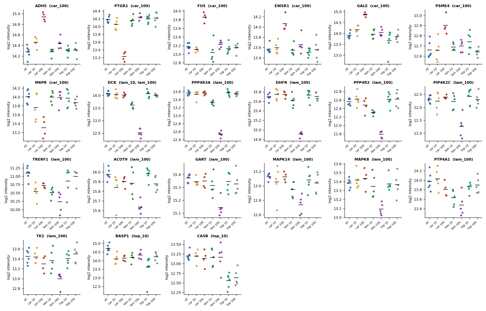
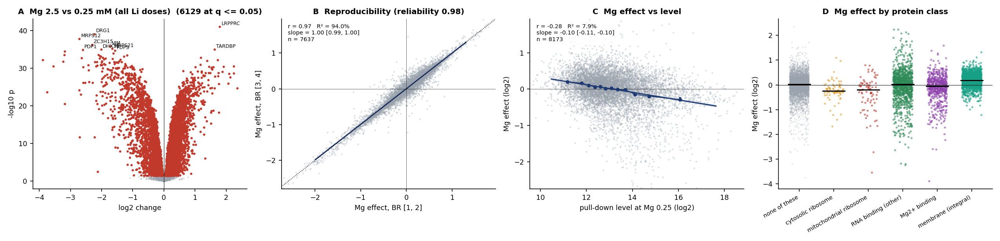
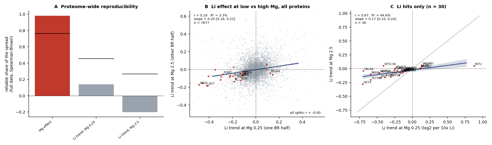
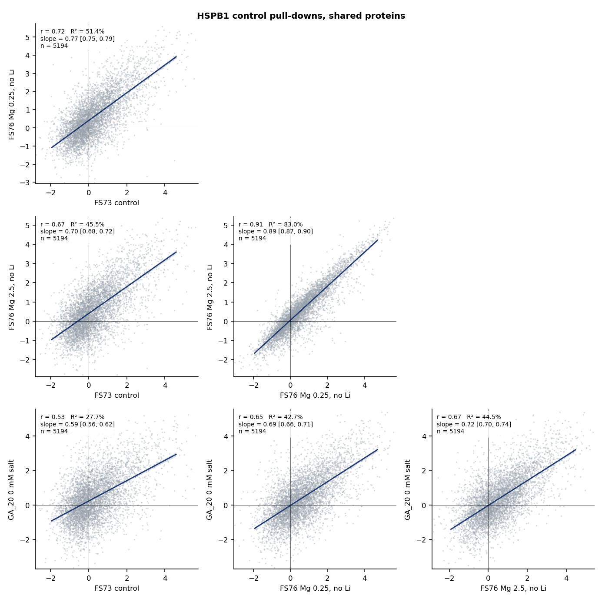

# Summary

Both screens are HA-HSPB1 pull-downs from HEK293 lysate at 37 °C, with the drug or salt added to the
lysate. Each was analysed with the same new pipeline (`code/pdpipe`, described in section 2). The
pipeline reproduces the lab's limma estimates in both workbooks (r 0.91-0.998 per contrast).

| | FS73: anticonvulsants | FS76: lithium |
|---|---|---|
| Broad change of the pull-down | none for any drug | none for Li; very large for Mg^2+^ |
| Proteins that change | 21 hits, all robust to dropping any replicate | 30 Li hits, almost all down |
| What the hits are | lamotrigine: DHFR (a known lamotrigine target), the nucleoside kinases DCK and TK2, GART, PP4 subunits, p38 and JNK kinases; topiramate: the carbonic anhydrase CA5B | Mg^2+^-dependent enzymes (3.3-fold enriched); the BAG6-GET4-UBL4A complex |
| Main conclusion | the hits look like drug binding pulling a protein off HSPB1 (target engagement), not a change in HSPB1 itself | at low Mg^2+^, Li^+^ acts like extra Mg^2+^ on these proteins; at 2.5 mM Mg^2+^ it does almost nothing |

The screens differ in kind from the temperature and salt experiments (GA_20, GA_33). There, thousands
of proteins move together. Here the treatments leave the pull-down as a whole unchanged and move a few
specific proteins. Magnesium is the exception: raising it from 0.25 to 2.5 mM changes 6,129 proteins.

# 1. The data

| | FS73 | FS76 |
|---|---|---|
| Bait | HA-HSPB1, 2 $\mu$g, 1 mg lysate | HSPB1 |
| Arms | control; carbamazepine, lamotrigine, topiramate at 10 and 100 $\mu$M | LiCl 0, 0.3, 1, 3, 5, 10 mM, traded against NaCl (constant ionic strength), at Mg^2+^ 0.25 and 2.5 mM |
| Samples used | 36 (4-6 per arm; 7 outliers removed upstream) | 44 (3-4 per arm; 4 removed upstream) |
| Proteins | 6,611 (6,100 detected in every sample) | 8,855 (7,287 in every sample) |
| Input | per-sample normalised log2 intensities from the lab's workbook (median normalisation) | same |

There are no input (lysate) measurements for either screen, so a change in the pull-down cannot be
split into a change in binding and a change in how much of the protein is in solution.

# 2. The standard pipeline

Every screen now goes through the same steps, so results from different experiments come out in the
same form (`python -m pdpipe.run <screen>`, configured by a short YAML file per screen):

1. **Load** the workbook into one standard table (proteins by samples, plus a sample sheet).
2. **Quality control**: sample correlations, principal components, detection per sample.
3. **Model**: for each protein, one mean per condition plus a replicate (BR) term when replicates
   behave as batches. They do in both screens (BR explains 28% and 21% of within-arm variance, against
   17% and 9% by chance). Variances are shrunk across proteins as limma does. Missing values are left
   out, never filled in.
4. **Check against the lab's numbers.**
5. **Reproducibility**: each comparison is computed separately in two halves of the replicates, and
   the two halves are correlated across proteins. That gives the share of the comparison's spread
   that is reproducible. It is the ceiling for anything that tries to explain it. It is tested
   against shuffled labels.
6. **Hit checks**: every hit recomputed leaving out each replicate; the top 10 hits from one half
   looked up in the other half; dose agreement and drug-to-drug agreement measured on disjoint
   replicates, so two comparisons that share a control are not correlated by that shared noise.

One lesson from building it is now written into the code. Both screens carry strong sample-to-sample
patterns that are not explained by the design. The largest within-arm pattern holds 19% of the
within-arm variance in FS73 and 21% in FS76, and it tracks how much bait each sample captured (r up to
-0.83). Removing these patterns looked like it made every comparison reproducible, even drug against
drug. That was manufactured: a correction learned from the same samples it is applied to shrinks each
half's own noise but not the noise the halves share. When the correction is learned on one half and
applied to the other, it changes nothing. The results below are therefore uncorrected.

# 3. FS73: anticonvulsants

## 3.1 No drug changes the pull-down as a whole

{width=100%}

| Comparison | Hits (q <= 0.05) | Reproducible share | Shuffled-label p | Top 10 hits in the other half: mean change (same sign) |
|---|---|---|---|---|
| carbamazepine 10 | 0 | 0.07 | 0.44 | 0.05 (53%) |
| carbamazepine 100 | 7 | 0.02 | 0.56 | 0.26 (62%) |
| lamotrigine 10 | 1 | 0.17 | 0.25 | 0.05 (57%) |
| lamotrigine 100 | 12 | 0.27 | 0.12 | **0.53 (80%)** |
| topiramate 10 | 2 | 0.10 | 0.28 | 0.11 (63%) |
| topiramate 100 | 0 | -0.31 | 0.94 | -0.07 (44%) |

Across all 6,611 proteins, no drug profile is reproducible beyond what shuffled labels give (panel A).
That rules out a broad effect on HSPB1, such as a change in its activity or in the overall amount it
captures. Only lamotrigine at 100 $\mu$M has hits that come back strongly in held-out replicates
(panel C): the top 10 found in one half keep about half their size, and 80% keep their sign, in the
other half. Carbamazepine 100 replicates partly. With 4-6 replicates per arm the shuffled-label test
cannot go below p 0.03, so it can only reject a broad effect, not detect a narrow one.

## 3.2 The hits are robust and drug-specific

{width=100%}

Every one of the 21 hits keeps its sign, and at least 70% of its size, when any single
replicate is left out. So none is carried by one sample. Each is specific to one drug.

| Drug | Hits | Pattern |
|---|---|---|
| lamotrigine 100 $\mu$M | DCK -1.54, PIP4K2C -1.10, PPP4R3A -1.02, TRERF1 -0.90, DHFR -0.77, PPP4R2 -0.76, PTP4A1 -0.50, TK2 -0.45, MAPK14 -0.39, ACOT9 -0.33, MAPK8 -0.30, GART -0.22 | all down; DCK already -0.45 at 10 $\mu$M; several others partly down at 10 $\mu$M |
| carbamazepine 100 $\mu$M | PTGR1 -0.97, M6PR -0.72; GALE +0.95, FUS +0.70, ADH5 +0.67, EWSR1 +0.49, PSME4 +0.27 | mixed; PTGR1, M6PR, ADH5 and GALE already shift at 10 $\mu$M |
| topiramate 10 $\mu$M | BASP1 -1.08, CA5B -0.64 | CA5B equally down at 100 $\mu$M (-0.59; not called there because that arm is noisier) |

Changes are log2, drug against control.

**Lamotrigine.** DHFR is a known lamotrigine target. Lamotrigine is a diaminotriazine, the chemical
class of antifolates, and it weakly inhibits DHFR. GART is a folate-dependent enzyme of purine
synthesis, and DCK and TK2 are nucleoside kinases. All are nucleotide or folate enzymes that could
bind a nucleobase-like ring. The other folate-binding proteins in the data do not move (TYMS +0.14,
MTHFD1 +0.02). Kinases as a class shift very slightly (median -0.03 vs -0.01, p 0.013), so the
effect is confined to a few of them.

**Topiramate.** Topiramate inhibits carbonic anhydrases. CA5B is one of only two carbonic anhydrases
detected, and it drops at both doses. The other, CA9, does not move.

**Carbamazepine.** Its hits go in both directions and have no obvious shared target. FUS and EWSR1
rise together, both FET-family RNA-binding proteins.

The simplest reading is the one used in thermal proteome profiling. A drug that binds a protein
stabilises it, and a stabilised protein is a poorer chaperone client, so less of it comes down with
HSPB1. On this reading the pull-down acts as a target-engagement readout. That fits all lamotrigine
hits going down. It does not explain the carbamazepine hits that go up.

## 3.3 Dose and drug agreement, on disjoint replicates

{width=100%}

Across all proteins, 10 and 100 $\mu$M of the same drug agree only weakly (r 0.06-0.11, averaged over
all splits). Two different drugs do not agree at all (r 0.01-0.07). The scatter is dominated by
noise because so few proteins respond. The hits sit far off the cloud, and in the dose panels they
sit in the same direction at both doses. In the drug-against-drug panels they sit near zero for the
other drug.

# 4. FS76: lithium and magnesium

## 4.1 Magnesium changes the pull-down broadly and reproducibly

{width=100%}

Raising Mg^2+^ ten-fold changes 6,129 of 8,855 proteins at q <= 0.05: 3,503 up and 2,626 down. The
spread is 0.49 log2 (sd). The profile is almost perfectly reproducible between halves (reproducible
share 0.98, panel B). That is the largest single effect in any HSPB1 experiment so far, and it is the
first principal component of the whole FS76 data (64% of all variance).

The bait itself falls 0.35 log2. Ribosomal proteins fall (cytosolic -0.24, mitochondrial -0.20,
median), and integral membrane proteins rise (+0.19). These classes explain only 4.4% of the Mg
effect, and the pull-down level explains 7.9%, against a ceiling of 98%. So most of the Mg effect is
reproducible but unexplained. It is a good target for the sequence models. It does not resemble the
salt effect of GA_20 (section 5, r 0.11), so it is not a generic ionic-strength effect.

## 4.2 Lithium moves a small set of proteins, almost all down

![Every Li hit: each sample against Li concentration (log scale; 0 drawn at 0.09 mM), blue at 0.25 mM Mg^2+^, orange at 2.5 mM. [Mg2+] marks proteins annotated as Mg^2+^-dependent in UniProt.](../figures/FS76/li_dose_curves.png){width=100%}

The dose trend is the slope of the six arm means on log10 Li: the log2 change per ten-fold more
lithium. The lab's spline dose model is in the workbook. Our trend and per-dose tests agree with it on
the strong hits, and our per-dose estimates match its estimates (r 0.92-0.96).

| Test | Proteins at q <= 0.05 |
|---|---|
| Li dose trend at Mg 0.25 mM | 28 |
| Li dose trend at Mg 2.5 mM | 2 (GET4, PC) |
| any Li dose differs from none, Mg 0.25 / 2.5 | 22 / 5 |
| trend differs between the two Mg levels | 8 |
| Mg 2.5 against 0.25 | 6,129 |

Thirty proteins pass at least one Li test. Twenty-five of them go down. Twenty-eight of the 30 keep
their sign at low Mg when any one replicate is left out. The exceptions are INTU, carried by one
10 mM sample, and UHRF1.

Across all proteins the Li profile is not reproducible (reproducible share 0.14 at low Mg and -0.20
at high Mg; shuffled-label p 0.31 and 0.81). As in FS73, lithium acts on a few proteins and leaves
the rest of the pull-down alone.

The hits are coherent:

- **Mg^2+^-dependent enzymes.** FAHD2A, NT5C3B, PGM3, DUT, LAP3, ADK, PC, GDPD1 and HDHD5 are
  metal-dependent hydrolases, mutases or kinases. Phosphoglucomutase-family enzymes such as PGM3 are
  classic lithium targets.
- **The BAG6 complex.** BAG6, GET4 and UBL4A form one complex. All three fall steeply, as does GET3,
  the ATPase they hand tail-anchored proteins to. BAG6 is itself a holdase chaperone.
- **The textbook lithium targets do not move.** GSK3B, IMPA1, IMPA2, INPP1 and BPNT1/2 change by at
  most 0.15 log2 and are not significant. So the pull-down does not report inhibition as such.

## 4.3 The Li effect disappears at high Mg

{width=100%}

All 30 hits respond less at 2.5 mM Mg^2+^ than at 0.25 mM. Their trends at high Mg are 0.17 times
their trends at low Mg [95% CI 0.10, 0.24]. The trends correlate (r 0.67), so the same proteins
respond, just less. This is what competition predicts. Li^+^ can occupy a Mg^2+^ site only while the
site is empty, and a ten-fold excess of Mg^2+^ fills it first.

## 4.4 Lithium acts on these proteins the way Mg^2+^ does

{width=100%}

| Test | Result |
|---|---|
| Mg^2+^-dependent proteins among the top 30 / 50 Li responders, low Mg | 27% / 24%, against 7.6% of all proteins (3.5x and 3.2x; p 0.001 and 0.0003) |
| same at high Mg | 17% / 14% (p 0.07, 0.08) |
| Zn^2+^-binding proteins (control) among the top 30 / 50 | 3% / 4%, against 11.5% (depleted) |
| Mg effect of the 30 Li hits | median -0.21 vs +0.05 for all proteins (p 0.005) |
| 10 mM Li effect against the Mg effect, Li hits | slope 0.72 [0.41, 1.03], r 0.67; 22 of 30 in the same direction |

Two of these results point the same way. The proteins lithium lowers at low Mg^2+^ are the ones that
raising Mg^2+^ also lowers. And 10 mM lithium reproduces about 70% of what a ten-fold rise in Mg^2+^
does to them (panel C, and the dose curves: the blue curves fall toward the orange baseline). Read
plainly: on these proteins Li^+^ fills the metal site that Mg^2+^ would fill, and a metal-loaded
enzyme binds HSPB1 less. This again fits "ligand-bound means less chaperone-bound". Here the ligand
is the metal ion.

Across all proteins, Li does not resemble the Mg effect (panel B, r 0.03). Mg^2+^ acts on thousands of
proteins and through many routes, while Li^+^ mimics it only at a few vacant metal sites.

The Mg^2+^ annotation is incomplete. Neither GDPD1 nor HDHD5 counts as Mg^2+^-dependent here, though
their families use divalent metals. The enrichment is therefore probably understated.

# 5. Across screens

{width=78%}

| Pair | r |
|---|---|
| FS76 Mg 0.25 vs FS76 Mg 2.5 (same experiment) | 0.91 |
| FS73 control vs FS76 (no Li) | 0.67-0.72 |
| GA_20 0 mM salt vs FS73 / FS76 | 0.53 / 0.65-0.67 |
| Mg effect (FS76) vs salt effect (GA_20, 75 or 150 mM) | 0.11 |

The HSPB1 pull-down is similar but far from identical between experiments. Across experiments the
control profiles share 28-52% of their variance; within FS76 the two Mg arms share 83%. Two things
follow. A comparison between screens should be made on effects, each against its own control, not on
raw levels. And lysis buffer, Mg^2+^ and salt are large enough variables that they should be recorded
for every screen. Mg^2+^ and NaCl change the pull-down in largely different ways.

# 6. Critical evaluation

- **Few replicates.** With 3-6 replicates per arm, a test with shuffled labels cannot reach p below
  0.03-0.12. So the proteome-wide reproducibility tests can only say "no broad effect". They cannot
  confirm narrow ones. The hits rest on the per-protein tests, on leaving out each replicate, on dose
  agreement, and on biology that was not used to call them. All four agree for lamotrigine and for
  lithium.
- **Several tests per screen.** The 30 Li hits are the union of four tests at q <= 0.05 each, so the
  false discovery rate of the union is somewhat above 5%. The weakest entries are UHRF1, DOLPP1 and
  INTU: none has a significant trend, and INTU and UHRF1 fail when one replicate is left out. They
  should be treated as unconfirmed.
- **Variance shrinkage is weak.** It borrows little across proteins here (prior df 2.3 and 1.8),
  because noise varies a lot between proteins. The q values are close to those of ordinary t-tests.
  Our hit counts are similar to the lab's (FS76 10 mM at low Mg: 27 vs 21, 19 shared), with
  differences at the margin from the replicate term.
- **Pull-down only.** Without input, "less in the pull-down" cannot be split into less binding and
  less in solution. Drug-induced precipitation of DCK or DHFR would look the same here. An input
  measurement of the lamotrigine and 10 mM Li arms would settle it.
- **The Mg effect could be partly a batch effect.** It is huge and perfectly reproducible, and the
  bait itself drops 0.35 log2. If the two Mg arms were prepared or run as separate batches, part of
  the effect could be processing. The data cannot tell; the run order can.
- **The nuisance patterns are real but not removable here.** They track how much bait each sample
  captured. A correction learned and applied on the same samples manufactured reproducibility. The
  cross-fitted correction changed nothing. Spiking a fixed amount of a foreign protein into each
  sample would give a correction that does not come from the data being corrected.

# 7. Questions for the lab and next steps

1. Were the two Mg^2+^ arms processed and injected interleaved, or as blocks? This decides how much of
   the 6,129-protein Mg effect is chemistry.
2. What is the base NaCl concentration in FS76? At 10 mM Li, how much of the NaCl was replaced?
3. Which vehicle was used for the drugs in FS73, and does the control arm contain it?
4. Is input (lysate) available for any arm? The lamotrigine 100 $\mu$M and Li 10 mM / Mg 0.25 mM arms
   would test the "drug-bound means less chaperone-bound" reading directly.
5. Next on our side:
   - a sequence model for the Mg effect, which is reproducible (ceiling 98%) and mostly unexplained
     by protein class (4.4%);
   - running GA_20, GA_33 and the GA_22/24 supernatants through the same pipeline, so every screen
     has the same QC, reproducibility and hit-check figures.

*Code: `code/pdpipe/` (pipeline), `code/fs00_convert.py` (workbook to table), `code/fs01_anticonvulsants.py`,
`code/fs02_lithium.py`, `code/fs03_cross.py`. Per-protein results: `data/fs_data/FS73/contrasts.tsv`,
`data/fs_data/FS76/fs02_tests.tsv`.*
