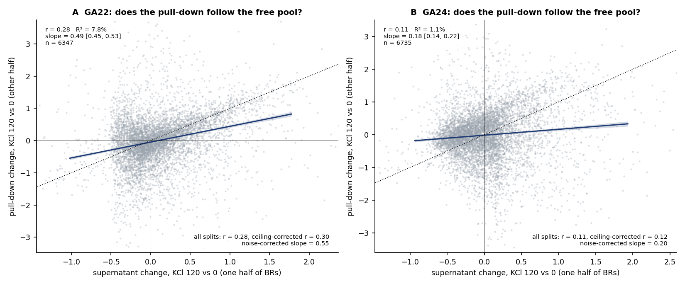
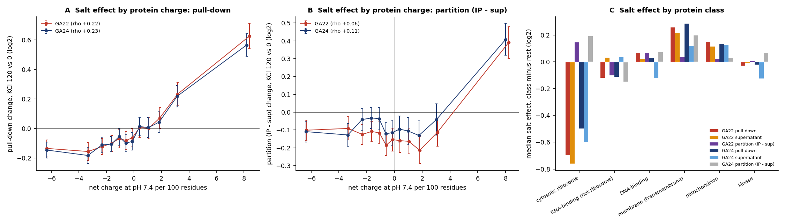
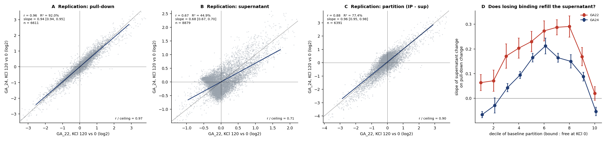
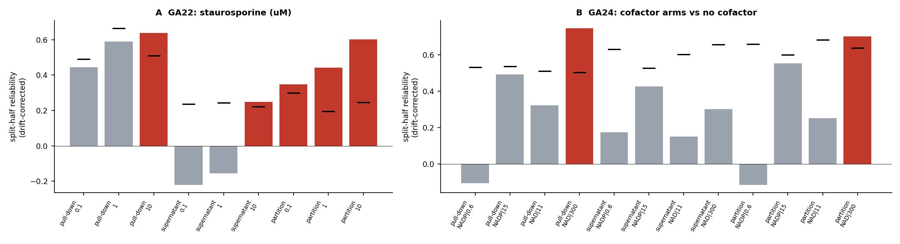
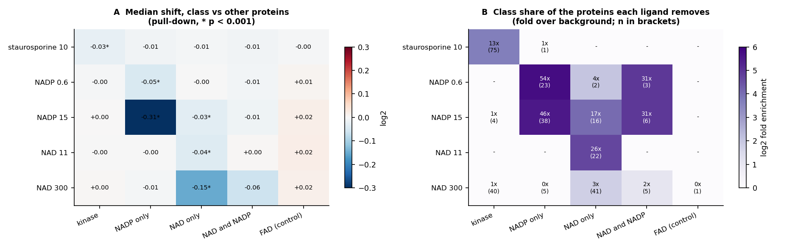
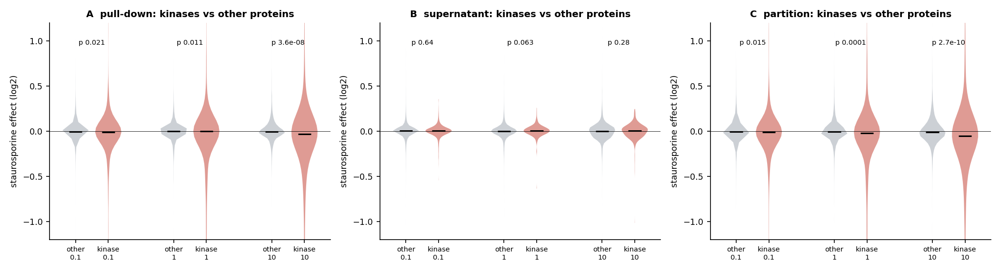
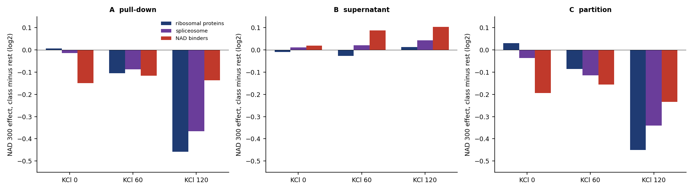

# Summary

Both experiments are HSPB1 pull-downs from lysate at 37 °C. For every reaction there is also the
supernatant left after the pull-down, which is the fraction that did not bind. Comparing the two in
each tube shows whether a change in the pull-down comes from a change in binding, or from a change in
how much of the protein was free to bind.

| Experiment | Arms | Replicates |
|---|---|---|
| GA_22 | KCl 0 / 60 / 120 mM × staurosporine 0 / 0.1 / 1 / 10 µM | 5 BR; pull-down 3 MS injections each, supernatant 1 |
| GA_24 | KCl 0 / 60 / 120 mM × no cofactor / NADP 0.6, 15 / NAD 11, 300 | same |

**Main findings.**

| | Result |
|---|---|
| **Each ligand takes its own binding proteins off HSPB1** | NADP removes NADP-binding enzymes: 46-54× enriched among the proteins it removes; G6PD, DHFR, BLVRA, RDH11/14, CRYZ, SPR fall 4- to 9-fold. NAD removes NAD-binding enzymes (26× at NAD 11): CTBP1/2, ALDHs, GAPDH, ADH5. Staurosporine removes kinases (13×): CAMK2D/G, CAMK1, CDK5, CDK2, CSK, MAP2K1/2, CHK2. The effects grow with dose, repeat at all three salt levels, and leave the other ligands' classes and FAD-binding proteins alone |
| Salt changes binding, not just the free pool | The salt effect is large and reproducible (reliability 0.91-0.99). Only 1-9% of the pull-down change is explained by the supernatant change. The bound : free change replicates between GA_22 and GA_24 at 0.90 of its ceiling. The pull-down change agrees with the earlier GA_20 salt titration at r 0.94-0.95 |
| What salt removes | Ribosomes (−0.5 to −0.7 log2), but through the free pool, not binding. Other RNA-binding proteins do lose binding. Charge acts mostly on the free pool, so salt is not mainly breaking simple electrostatic binding to HSPB1 |
| A second NAD 300 effect, unresolved | At 120 mM KCl only, NAD 300 also removes ribosomal and spliceosome proteins from the bound fraction. It comes from one set of five reactions and cannot be told apart from a handling batch of that set |
| **Data problems found and handled** | **MS drift.** It explains 9-18% of within-condition variance. The cofactor arms were injected in partly separate blocks, which made several NAD(P) arms look reproducible when they were not. Drift is now modelled. **Failed supernatant blocks.** Two (BR5 at one salt level in each experiment) were dropped |

**Interpretation.** The ligand result generalises what FS73 showed for lamotrigine (DHFR) and
topiramate (CA5B):

- when a small molecule binds its protein, that protein comes off HSPB1;
- the effect is specific and graded with dose;
- the bound fraction moves even when the free pool barely changes.

The simplest reading is stabilisation. Ligand binding holds the protein in its folded state, and
HSPB1 binds less-folded or more dynamic states. If so, the HSPB1 pull-down works as a proteome-wide
readout of target engagement.

# 1. Data and processing

| | GA_22 pull-down | GA_22 supernatant | GA_24 pull-down | GA_24 supernatant |
|---|---|---|---|---|
| Proteins | 7,116 | 9,600 | 7,507 | 9,951 |
| Reactions used | 60 | 56 | 75 | 70 |

Files: pull-downs `GA22_report_out.tsv` and `GA24_report_out.tsv`; supernatants `GA_22_Proteome_report_out.tsv` and
`GA_24_Proteome_report_out.tsv` (all in `pd_data/`).

**New pipeline loader.** `pdpipe` now reads these DIA-NN reports (`io.load_diann`):

- Technical injections are averaged in log2. Two GA_22 reactions were injected twice and are
  averaged too.
- Each sample is median-normalised as for GA_33, and the removed offsets are kept.
- The pull-down and supernatant of each tube are paired into a partition (log2 pull-down − log2
  supernatant, `pdpipe.partition`). This is the bound : free ratio, up to a constant.

**Two supernatant blocks failed.** I scored each sample by how well it carries its condition's
profile, measured against the other samples of that condition (leave-one-out). Two blocks failed
together, and both were dropped:

- GA_22, BR5 at KCl 60: r −0.20 to −0.09 in all four arms;
- GA_24, BR5 at KCl 120: r −0.38 to +0.04 in all five arms.

Every pull-down sample passed (lowest 0.40, median 0.87-0.91).

{width=100%}

**MS drift, and why it matters here.** Within a condition, protein levels drift with injection order:

| Dataset | Variance explained by position | Chance threshold (95%) |
|---|---|---|
| GA_22 pull-down | 16% | 6% |
| GA_24 pull-down | 18% | 5% |
| GA_24 supernatant | 14% | 6% |
| GA_22 supernatant | 9% | 7% |

Salt is balanced across the run, so drift only adds noise to the salt effects. The ligands are not
balanced:

- **GA_24:** the cofactor arms were injected roughly as blocks. Mean position runs from 0.30 for no
  cofactor to 0.70 for NADP 15.
- **GA_22:** staurosporine 0.1 and 10 µM sit later in the run than 0 and 1 µM.

Before correction, every GA_24 arm differed reproducibly from every other arm, including the
no-cofactor arm (reliability 0.55-0.67). Yet the arms shared no common profile. That pattern means
the arm differences came from when each block was run, not from the cofactor.

All models now include a quadratic drift term, and reliabilities use a cross-fitted drift correction
(learned on one half of the replicates, applied to the other). I also fixed a fault the correction
exposed. For proteins with many missing values, the drift term could become aliased with a sparse
condition and inflate its estimate; such proteins are now fitted without the drift term
(`stats.lmfit(covar=...)`).

Drift correction cannot remove differences in how each arm was handled on the bench. That is why
section 3 rests on biological specificity, which neither drift nor bench handling can produce.

# 2. Salt

## 2.1 A large, reproducible effect

| | GA_22, 60 mM | GA_22, 120 mM | GA_24, 60 mM | GA_24, 120 mM |
|---|---|---|---|---|
| Pull-down: reliability (chance threshold) | 0.96 (0.62) | 0.99 (0.64) | 0.91 (0.86) | 0.99 (0.85) |
| Supernatant | 0.92 (0.62) | 0.94 (0.47) | 0.84 (0.77) | 0.95 (0.57) |
| Partition | 0.95 (0.69) | 0.97 (0.55) | 0.90 (0.84) | 0.97 (0.63) |
| Pull-down proteins changed (q ≤ 0.05), up / down | 2,435 / 2,434 | 2,761 / 2,692 | 2,938 / 2,938 | 3,143 / 3,176 |

The salt effect is averaged over the second factor, which is balanced. At 60 mM it is about 55-60% of
the 120 mM effect in every measure (noise-corrected slope).

The chance threshold for GA_24 at 60 mM is high (0.86) because the label permutations keep part of
the real effect. The 120 mM effect is clear in both experiments.

**The bait.** HSPB1 itself rises in the pull-down (+0.5 to +0.65 log2 at 120 mM, relative to the
median protein) and falls in the supernatant (−0.17 to −0.37). At high salt, more of the bait ends up
on the beads, or less of everything else does.

## 2.2 Salt changes binding, not just the free pool

If the pull-down changed only because salt changed how much of each protein was free, the pull-down
change would equal the supernatant change: slope 1, and r near the ceiling. The two are estimated
from disjoint replicates, because a tube's pull-down and supernatant share its handling noise.

{width=100%}

| | GA_22 | GA_24 |
|---|---|---|
| r, all splits | 0.28 | 0.11 |
| r corrected for each measure's noise | 0.30 | 0.12 |
| Share of the reproducible pull-down change explained | 9% | 1% |
| Slope, corrected for noise in x | 0.55 | 0.20 |

So salt changes the bound : free partition. The partition change is reproducible (0.97 in both
experiments) and replicates between experiments better than the raw pull-down (section 2.5).

## 2.3 What salt breaks

{width=100%}

**Charge.** Positively charged proteins rise with salt in the pull-down (rho +0.22 in both
experiments). The rise comes mostly from the free pool (+0.26 / +0.16), with little in the partition
(+0.06 / +0.11). Charge explains 2-5% of the variance.

HSPB1 is acidic. If salt mainly broke electrostatic binding to it, basic proteins would lose binding,
which is the opposite of what is seen. Salt does release basic proteins into solution, consistent
with weakening nucleic-acid and chromatin contacts.

**Classes.** Median salt effect at 120 mM, class minus all other proteins, GA_22 / GA_24:

| Class | Pull-down | Supernatant | Partition |
|---|---|---|---|
| Cytosolic ribosome | −0.70 / −0.50 | −0.76 / −0.60 | +0.15 / +0.20 |
| RNA-binding (non-ribosomal) | −0.12 / −0.11 | +0.03 / +0.03 | −0.10 / −0.14 |
| Transmembrane | +0.26 / +0.29 | +0.21 / +0.12 | +0.03 / +0.20 |
| Mitochondrial | +0.15 / +0.14 | +0.12 / +0.13 | +0.02 / +0.03 |

What the classes show:

- **Ribosomes** leave the pull-down because they leave the free pool; their binding, if anything,
  rises.
- **Other RNA-binding proteins** lose binding: partition −0.10 / −0.14 with an unchanged pool. These
  are the proteins whose contact with HSPB1 salt weakens.
- **Mitochondrial proteins** rise through the pool only.
- **Transmembrane proteins** rise through the pool in GA_22, and partly through binding in GA_24.

## 2.4 Is the bound fraction big enough to deplete the supernatant?

If a large share of a protein sat on the beads, losing that binding would raise its supernatant level.
That would give a negative slope of supernatant change on pull-down change among the most strongly
bound proteins. Panel D below shows the slope by decile of the baseline bound : free ratio.

- The slope is positive in the middle deciles (+0.2 to +0.3), from shared pool changes.
- It drops to about zero in the top decile: +0.02 in GA_22, −0.05 ± 0.02 in GA_24.

This hints that only the most strongly bound proteins are depleted from solution, and only slightly.
For most proteins the bound fraction is small. That matters for section 3: a ligand can move the bound
fraction strongly with almost no change in the supernatant.

## 2.5 Replication across three salt experiments

{width=100%}

| Comparison | r | Slope | r / ceiling |
|---|---|---|---|
| GA_22 vs GA_24, pull-down | 0.96 | 0.94 | 0.97 |
| GA_22 vs GA_24, supernatant | 0.67 | 0.69 | 0.71 |
| GA_22 vs GA_24, partition | 0.88 | 0.96 | 0.90 |
| GA_20 (150 mM) vs GA_22 / GA_24 pull-down (120 mM) | 0.95 / 0.94 | 0.80 / 0.78 | |
| GA_20 (75 mM) vs GA_22 / GA_24 pull-down (60 mM) | 0.92 / 0.92 | 0.70 / 0.70 | |

The salt effect on the HSPB1 pull-down is one of the most reproducible results in these data. The
supernatant replicates less well. It is a single injection per reaction, and its salt effect is
smaller.

# 3. Ligands: each one takes its own binding proteins off HSPB1

## 3.1 Proteome-wide reproducibility after drift correction

{width=100%}

| Contrast | Pull-down | Supernatant | Partition |
|---|---|---|---|
| Staurosporine 10 µM | 0.64 (chance 0.51) | 0.25 (0.22) | 0.60 (0.25), p 0.048 |
| NADP 15 | 0.49 (0.54) | 0.43 (0.53) | 0.55 (0.60) |
| NAD 300 | 0.75 (0.51), p 0.048 | 0.30 (0.66) | 0.70 (0.64) |
| NADP 0.6, NAD 11 | below chance | below chance | below chance |

Only NAD 300 (pull-down) and staurosporine 10 µM (partition) are reproducible proteome-wide. The
other ligands change a few dozen proteins strongly and leave the rest, so a proteome-wide
reliability misses them. The class tests below do not.

## 3.2 The ligand × protein-class test

I annotated proteins from UniProt keywords:

| Class | Proteins in UniProt |
|---|---|
| NAD-binding only | 191 |
| NADP-binding only | 180 |
| Both | about 30 |
| FAD-binding (a cofactor control) | 111 |
| Kinases | 625 |

Each ligand is tested against every class. A drift or handling artefact has no reason to pick out
the cognate class.

{width=100%}

| Ligand | Proteins removed (q ≤ 0.05) | Kinases | NADP-only binders | NAD-only binders | FAD binders |
|---|---|---|---|---|---|
| Staurosporine 10 µM | 116 | **75 (13×)** | 1 (1×) | 0 | 0 |
| NADP 0.6 | 42 | 0 | **23 (54×)** | 2 (4×) | 0 |
| NADP 15 | 84 | 4 (1×) | **38 (46×)** | 16 (17×) | 0 |
| NAD 11 | 74 | 0 | 0 | **22 (26×)** | 0 |
| NAD 300 | 1,029 | 40 (1×) | 5 (0.5×) | **41 (3×)** | 1 (0.2×) |

Every ligand picks its own class, and the FAD-binding control class never moves.

- **Staurosporine.** The median shift of all kinases is small (−0.03) because most kinases do not
  bind it. Those that do fall by 2- to 8-fold.
- **NADP 15** also removes some NAD-only binders (17×). Many dehydrogenases bind both cofactors
  weakly, and the keywords miss some dual binders. The cognate class is still three times more
  enriched.
- **NAD 300** dilutes its cognate signal with a large second effect (section 3.5). At NAD 11 the
  cognate enrichment is clean.

**The class effects repeat at every salt level.** Each salt level has its own control reactions, so
these are three independent repeats:

| Class effect (median shift, pull-down) | KCl 0 | KCl 60 | KCl 120 |
|---|---|---|---|
| NADP 15 on NADP binders | −0.50 (p 5e-14) | −0.30 (2e-12) | −0.13 (3e-8) |
| NAD 300 on NAD binders | −0.15 (2e-10) | −0.12 (9e-9) | −0.14 (1e-7) |
| Staurosporine 10 on kinases | −0.03 (7e-6) | −0.03 (5e-10) | −0.04 (2e-7) |

The NADP effect weakens with salt. The individual responders show why: their fall at 120 mM is
roughly half what it is at 0 mM (G6PD −3.0 → −1.9; SPR −3.1 → −1.2).

{width=100%}

{width=100%}

## 3.3 The responders

Strongest cognate responders, log2 change in the pull-down. Sup and Part are the high-dose effect in
the supernatant and in the partition.

| Ligand | Protein | Low dose | High dose | KCl 0/60/120 | Sup | Part |
|--------|--------|------|------|----------------|------|------|
| NADP | DHRS7 | −1.18 | −3.16 | −2.70/−3.28/−3.48 | +0.21 | −3.39 |
|  | BLVRA | −0.63 | −2.98 | −3.49/−2.95/−2.51 | +0.22 | −3.20 |
|  | G6PD | −0.60 | −2.46 | −3.04/−2.44/−1.91 | +0.12 | −2.58 |
|  | RDH11 | −0.16 | −2.33 | −2.85/−2.36/−1.80 | +0.46 | −2.79 |
|  | DHFR | −0.13 | −2.19 | −2.39/−2.38/−1.81 | +0.37 | −2.56 |
| NAD | CTBP2 | −0.83 | −3.62 | −3.25/−3.75/−3.86 | +0.14 | −3.74 |
|  | ALDH7A1 | −0.51 | −3.28 | −3.21/−3.51/−3.13 | +0.17 | −3.47 |
|  | ALDH4A1 | −0.06 | −2.76 | −3.49/−2.77/−2.01 | +0.50 | −3.26 |
|  | CTBP1 | −0.56 | −2.72 | −2.65/−2.79/−2.72 | +0.17 | −2.89 |
| Staurosporine | CAMK2D | −2.88 | −2.91 | −3.08/−2.82/−2.82 | +0.02 | −2.94 |
|  | CAMK2G | −2.79 | −2.80 | −3.06/−2.83/−2.52 | +0.04 | −2.83 |
|  | CAMK1 | −1.54 | −2.60 | −3.13/−2.58/−2.10 | −0.06 | −2.59 |
|  | CDK5 | −1.07 | −2.37 | −2.36/−2.38/−2.38 | −0.04 | −2.35 |

Further responders: NADP: CRYZ, GRHPR, SPR, PTGR1, RDH14, GMDS, FDXR (−1.7 to −2.2); NAD: BDH2, ALDH1B1, ALDH6A1, ADH5, CYB5R4, HADH, GAPDH (−1.8 to −2.6); staurosporine: CSK, MAP2K1/2, STK4, CDK2, GAK, CHEK2, PHKG2 (−1.6 to −2.3).

Low and high doses: NADP 0.6 and 15, NAD 11 and 300, staurosporine 1 and 10 µM. Full lists are in
`data/fs_data/GA22_24/*_responders.tsv`.

**Notes on the lists:**

- **DHFR** is the protein that lamotrigine took off HSPB1 in FS73. Here its cofactor does the same.
  This supports reading the FS73 result as engagement of DHFR by lamotrigine.
- **ADH5** rose with carbamazepine in FS73 and falls with NAD here. One protein can be pushed either
  way, as the screen report's open-versus-stabilise table anticipated.
- **CTBP1/2** are NAD(H)-sensing transcriptional co-repressors. Their response is among the largest.
- **The staurosporine responders** are well-known high-affinity targets: CAMK2, CDK2/5, CHK2, CSK,
  MAP2K1/2.

**The supernatant barely moves**, apart from a small rise (+0.1 to +0.5) for the NADP and NAD
responders. The bound fraction falls 4- to 9-fold, so only a small share of each protein was on
HSPB1 to begin with. This matches section 2.4.

The supernatant rise is also less specific than the pull-down fall. Cofactor binders of either kind
rise slightly with any cofactor arm (+0.03 to +0.07), with the cognate class largest (NADP 15 on NADP
binders, +0.14).

## 3.4 What the ligand effect means

A ligand that binds its protein holds it in the folded state. If HSPB1 binds proteins in partly
unfolded or dynamic states, binding the ligand lowers the protein's affinity for HSPB1, and the
protein leaves the beads while staying in solution. All the observations fit:

- the effects are specific to the ligand's own class;
- they are graded with dose;
- the bound fraction moves strongly while the free pool barely does;
- HSPB1 itself does not change (NAD(P) arms |Δ| ≤ 0.04; staurosporine q > 0.7).

This is the same logic as thermal proteome profiling and limited-proteolysis screens, read out
through a chaperone instead of heat or protease.

## 3.5 A second NAD 300 effect, unresolved

NAD 300 changes 2,300 proteins in all, many more than its cognate binders. The extra effect is
concentrated in RNA-protein complexes:

- ribosomal proteins: 109 of 159 down;
- spliceosome and mRNA-processing proteins: about 4× enriched;
- citrullinated proteins: 33 of 41 down.

{width=100%}

| NAD 300 effect, class minus rest | KCl 0 | KCl 60 | KCl 120 |
|---|---|---|---|
| Ribosomal proteins, pull-down | +0.01 | −0.10 | −0.46 |
| Ribosomal proteins, supernatant | −0.01 | −0.03 | +0.01 |
| Spliceosome, pull-down | −0.02 | −0.09 | −0.37 |
| NAD binders, pull-down | −0.11 | −0.11 | −0.11 |

Two features separate it from the cognate effect: it needs high salt, and NAD 11 does not show it.
That fits two explanations:

- a real NAD × salt interaction, for example NAD at high ionic strength competing with RNA-mediated
  bridging;
- a handling difference in the five NAD 300 / KCl 120 reactions.

These data cannot tell them apart. A repeat with that arm split across processing batches would.

# 4. Critical evaluation

1. **Drift and block injection.** The cofactor arms were injected in blocks, and the drift correction
   is a model. Its estimates depend somewhat on the shape assumed. With a linear drift and with a
   cubic drift, the NAD 300 reliability at 120 mM is 0.72 and 0.66, against 0.81 with the quadratic
   drift I used. That is why the ligand conclusions rest on the class test.
2. **Is the class test immune to batch?** A batch would have to hit NADP binders only in the NADP
   arms, NAD binders only in the NAD arms, and kinases only with staurosporine (a separate
   experiment), at every salt level and graded with dose. I cannot construct such an artefact.
3. **Annotation.** UniProt keywords miss some NAD/NADP binders and some dual binders, which makes the
   cross-class effects (NADP 15 on NAD-only binders, 17×) hard to read. The cognate preference holds
   under these imperfect labels.
4. **Units.** NADP 0.6 / 15 and NAD 11 / 300 are taken from the sample names. I have assumed µM
   (physiological ranges); the lab should confirm.
5. **Normalisation.** Every sample is median-normalised, so all effects are relative to the median
   protein. The global fall of the pull-down with salt (0.5-0.7 log2) is real only if equal amounts
   were injected.
6. **The partition** is a ratio of two separately normalised MS runs, so only changes in it are
   interpretable. For the same reason, depletion (section 2.4) can only be read from slopes.
7. **Staurosporine at 0.1 µM** looks reproducible before drift correction. After correction it is
   below chance proteome-wide, while the kinase class test is already nominally significant
   (p 0.02). Its proteome-wide signal was mostly injection order.

# 5. Questions for the lab

1. **NAD(P) units.** Are the NADP 0.6 / 15 and NAD 11 / 300 values in µM?
2. **Injection order.** Can future runs randomise it across arms? The cofactor arms here were
   injected roughly in blocks.
3. **The two failed supernatant blocks.** Was anything different about GA_22 BR5 at KCl 60 and GA_24
   BR5 at KCl 120?
4. **The NAD 300 / KCl 120 reactions.** Were they processed separately? If not, the ribonucleoprotein
   effect deserves a repeat.
5. **Was equal volume or equal amount injected** for the pull-downs? This decides whether the global
   fall with salt is real.
6. **A next experiment.** A dose series of a known drug on its target would test whether the HSPB1
   pull-down can serve as a target-engagement assay. For example, methotrexate on DHFR, or a
   selective kinase inhibitor, each with an inactive analogue.

# 6. Files

- Code:
  - `code/fs07_ga_salt.py` (salt);
  - `code/fs08_ga_ligands.py` (ligands);
  - pipeline additions: `pdpipe/io.load_diann` and `uniprot_annotation`, `pdpipe/partition.py`;
  - in `pdpipe/stats`: `drift_basis`, `drift_adjuster`, `half_effects`, `cross_dataset`,
    `sample_fit`, guarded `lmfit`;
  - configs `ga22`, `ga22s`, `ga24`, `ga24s`.
- Results in `data/fs_data/GA22_24/`:
  - `fs07.json`, `fs08.json`;
  - per-protein salt and ligand tables for pull-down, supernatant and partition;
  - responder lists for NADP binders, NAD binders and kinases.
- Figures: `reports/figures/GA22_24/`.
- UniProt annotation with sequences: `data/annot/uniprot_human_full.tsv.gz`.
